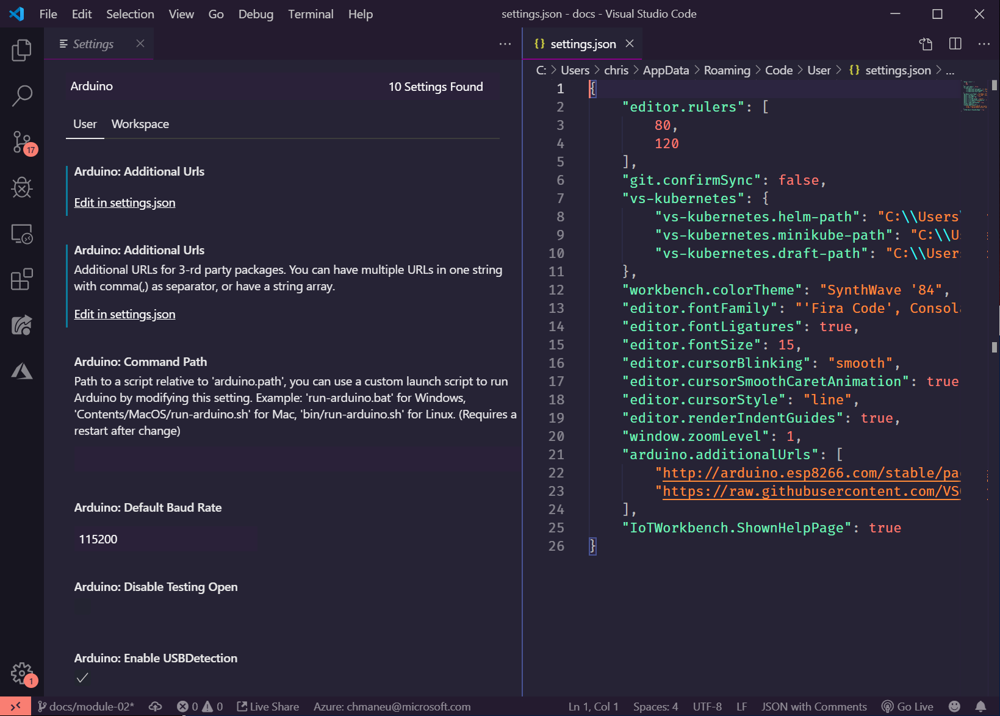
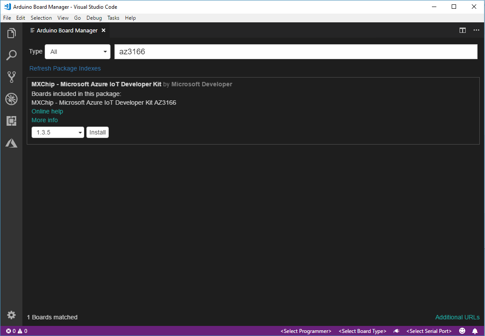

# Configurer son environnement de développement

## Module Azure Functions

Pour le module _Détectez l'activité du compresseur avec une Azure Function_, 
il vous sera nécessaire d'installer les éléments suivants sur votre poste de 
développement: 

- [Visual Studio Code][vscode-home] ainsi que quelques extensions
    - L'extension [Azure Tools][vscode-azureext],
    - Les extensions pour les langages que vous allez utiliser
        - [C#][vscode-csharpext],
        - Python (**3.6** et non pas 3.7)
        - Java
        - JavaScript/NodeJS est déjà inclus :)

[vscode-home]: https://code.visualstudio.com/?wt.mc_id=blinkingcompressor-github-chmaneu
[vscode-azureext]: https://marketplace.visualstudio.com/items?itemName=ms-vscode.vscode-node-azure-pack&wt.mc_id=blinkingcompressor-github-chmaneu
[vscode-csharpext]: https://marketplace.visualstudio.com/items?itemName=ms-vscode.csharp&wt.mc_id=blinkingcompressor-github-chmaneu    

## Module _Connectez vos devices IoT au Cloud_

Pour ce module, vous aurez besoin d'un certain nombre de composants. Le MXChip étant une board Arduino,
il vous faudra installer pas mal de choses. Je vous conseille de lancer l'installation en parallèle de la réalisation
du second module. 

- [Visual Studio Code][vscode-home] ainsi que quelques extensions
    - L'extension [Azure IoT tools][vscode-iottoolsext] ([Installer](vscode:extension/vsciot-vscode.azure-iot-tools)), qui contient notamment _IoT Workbench_,
    - L'extension [Arduino][vscode-arduinoext] de l'éditeur Microsoft,
    
- [Arduino IDE][arduino-ide]: il contient les outils de builds et de déploiment pour la carte MXChip. **Attention:** Installez la version "standalone", et non pas la version du Store.
- Le driver _ST-Link_: 
	* Windows
	Télécharger et installer le driver depuis le site [STMicro](http://www.st.com/en/development-tools/stsw-link009.html).

	* macOS
	Pas de driver nécessaire

	* Ubuntu
  	Exécuter la commande suivante dans votre terminal, puis déconnectez/reconnectez-vous afin d'appliquer le changement 
    de permissions. Lisez la note ci-dessous avant.

		```bash
		# Copy the default rules. This grants permission to the group 'plugdev'
		sudo cp ~/.arduino15/packages/AZ3166/tools/openocd/0.10.0/linux/contrib/60-openocd.rules /etc/udev/rules.d/
		sudo udevadm control --reload-rules
		
		# Add yourself to the group 'plugdev'
		# Logout and log back in for the group to take effect
		sudo usermod -a -G plugdev $(whoami)
		```

?> Vous êtes sous Ubuntu ? Cette dernière étape est à réaliser à la fin de cette partie. En effet, le dossier 
`packages/AZ3166` est créé lors d'une prochaine étape.

Une fois l'ensemble de ces composants installés, il faudra s'assurer que Visual Studio Code puisse utiliser l'installation
d'Arduino. Ouvrir **File > Preference > Settings** et faites une recherche sur "Arduino". Vous verrez alors
un bouton vous permettant d'éditer les URLs additionnelles dans le fichier `settings.json`.
Il suffit alors d'ajouter les lignes ci-dessous à votre configuration.

?> Il est également possible d'ouvrir directement les settings avec l'éditeur JSON en utilisant la commande
`Preferences: Open Settings (JSON)`.



Voici les valeurs par défaut à ajouter à cette configuration:

* Windows

```JSON
"arduino.path": "C:\\Program Files (x86)\\Arduino",
"arduino.additionalUrls": "https://raw.githubusercontent.com/VSChina/azureiotdevkit_tools/master/package_azureboard_index.json"
```

* macOS

```JSON
"arduino.path": "/Applications",
"arduino.additionalUrls": "https://raw.githubusercontent.com/VSChina/azureiotdevkit_tools/master/package_azureboard_index.json"
```

* Ubuntu

```JSON
"arduino.path": "/home/{username}/Downloads/arduino-1.8.5",
"arduino.additionalUrls": "https://raw.githubusercontent.com/VSChina/azureiotdevkit_tools/master/package_azureboard_index.json"
```

**Pensez à sauvegarder vos paramètres avant de passer à l'étape suivante !**

Enfin il faudra ajouter le SDK spécifique pour la board Arduino MXChip. Pour cela, via la palette de commande (`Ctrl+Shift+P`
 ou `Cmd+Shif+P`), ouvrir la page **Arduino: Board Manager**, et rechercher **AZ3166**, puis installer la version `1.6.0`.




## Connecter votre board au WiFi

Votre board est normalement déjà configurée. Si vous deviez la reconnecter au WiFi, vous trouverez
[les instructions ici](01-prepare-environment/configure-wifi.md).


[arduino]: https://www.arduino.cc
[vscode-csharpext]: https://marketplace.visualstudio.com/items?itemName=ms-vscode.csharp&wt.mc_id=blinkingcompressor-github-chmaneu
[arduino-ide]: https://www.arduino.cc/en/Main/Software
[vscode-iottoolsext]: https://marketplace.visualstudio.com/items?itemName=vsciot-vscode.azure-iot-tools&wt.mc_id=blinkingcompressor-github-chmaneu
[vscode-arduinoext]: https://marketplace.visualstudio.com/items?itemName=vsciot-vscode.vscode-arduino&wt.mc_id=blinkingcompressor-github-chmaneu
[vscode-azureext]: https://marketplace.visualstudio.com/items?itemName=ms-vscode.vscode-node-azure-pack&wt.mc_id=blinkingcompressor-github-chmaneu