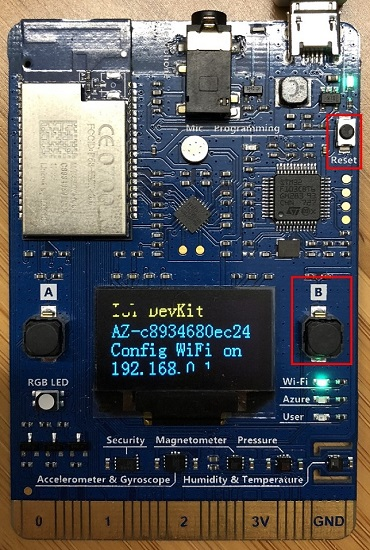
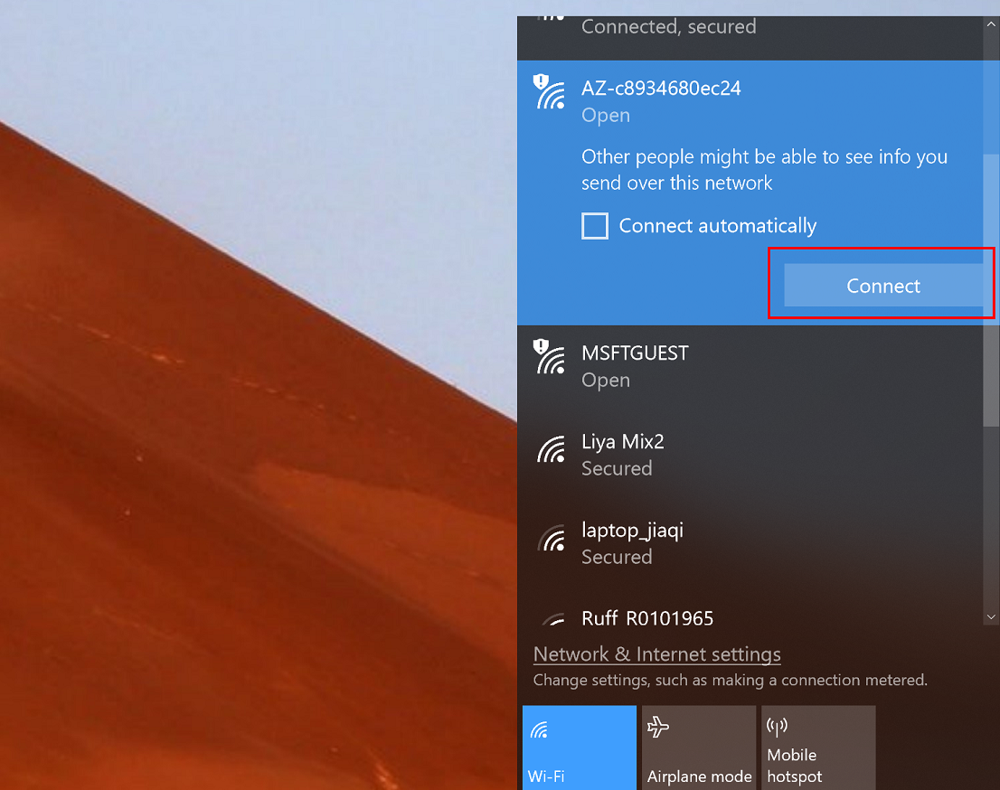
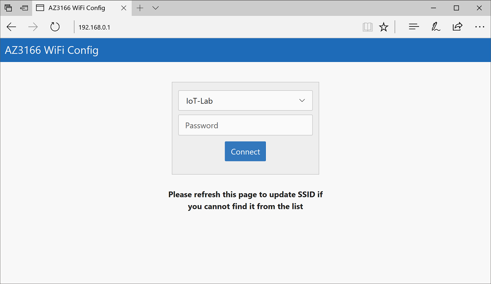
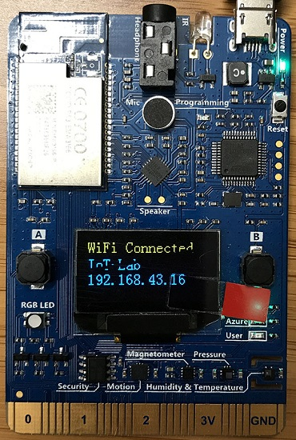

# Configurer le Wi-Fi de votre MX Chip

L'atelier IoT nécessite une connectivité Internet. Nous aurons normalement déjà configuré le Wifi, mais au cas où, voici la procédure à suivre.

1. Maintenir appuyé le bouton **B**, appuyer et relacher le bouton **Reset** , puis relâcher le bouton **B**. La board va alors passer en mode _configuration WiFi_. Pour se faire, il va lui-même diffuser un point d'accès auquel se connecter. L'écran affiche ainsi le SSID, ainsi que l'adresse IP à utiliser.

    

2. Connectez-vous au réseau WiFi indiqué sur la board. Si votre appareil demande un mot de passe, laissez-le vide.

    

3. Ouvrez **192.168.0.1** dans un navigateur. Sélectionnez le réseau sur lequel vous souhaitez vous connecter. Indiquez la clé WEP/WPA, puis cliquez sur **Connect**.

    

4. La board va redémarrer quelques secondes après. Elle affichera alors au démarrage le texte `Wifi...OK` après quelques instants.

    