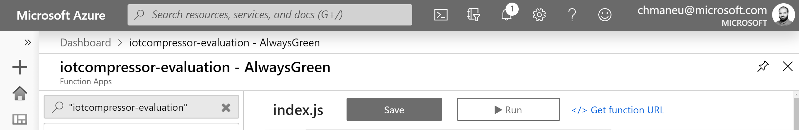

# Connectez votre function à Tailwind Diving 🏭

Maintenant que votre Azure Function de prédiction est prête, il est temps de la connecter au service !
Comme indiqué précédemment, nous avons déjà connecté votre board à Azure. Il faut donc maintenant
que notre système connaisse votre board afin de pouvoir appeler votre fonction à la réception
d'une nouvelle donnée de télémétrie.

## Récupérer l'adresse de son Azure Function

L'adresse de votre Azure Function est composée de différentes parties : 
- Le nom de votre application (choisi au moment de la création), suivi de `azurewebsites.net`,
- un préfixe, souvent `api`,
- le nom de votre méthode,
- si votre fonction est protégée, la clé de fonction (propre à chaque fonction), ou une des _master keys_ permettant 
d'accéder à l'ensemble des fonctions de l'application.

Le plus simple pour récupérer l'adresse est de se rendre dans le portail Azure sur votre application. Choisissez ensuite
votre fonction et cliquez sur le lien **Get Function **.

La popup qui s'ouvre alors contient le chemin vers votre fonction, et éventuellement avec la clée de fonction. Copiez
cette URL pour la prochaine étape.

> Bien évidemment, il est possible de déployer une Azure Function avec son propre nom de domaine, mais également
> avec ses propres préfixes ou chemins. La preuve ? [maneu.fr](https://www.maneu.fr/?wt.mc_id=devroadshowiot-github-chmaneu)
> n'est qu'une Azure Function :smiling:.

## Enregistrer son webhook

TK : Screenshot interface François.

## Tester son fonctionnement

Désormais, votre Azure Function devrait être appelée à chaque réception de donnée télémétrique du device. En situation normale
(version de code 0.2), cela arrivera environ toutes les 10 secondes. Vous pouvez streamer les logs (depuis VS Code ou 
le portail) pour voir l'exécution de votre fonction. 

Pour changer les valeurs de votre board, il suffit généralement d'appliquer l'un de vos doigts sur le capteur de température.
Si cela ne suffit pas, vous pouvez frotter votre doigt contre la paume de la main pour le réchauffer.
Penez à laisser votre doigt plusieurs secondes, les données n'étant pas envoyées à chaque seconde.