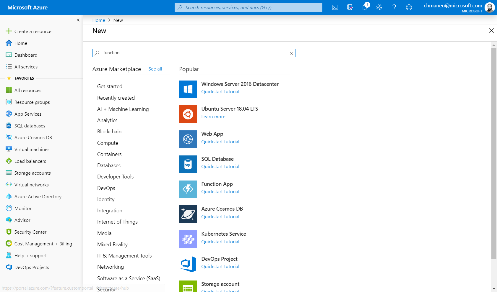
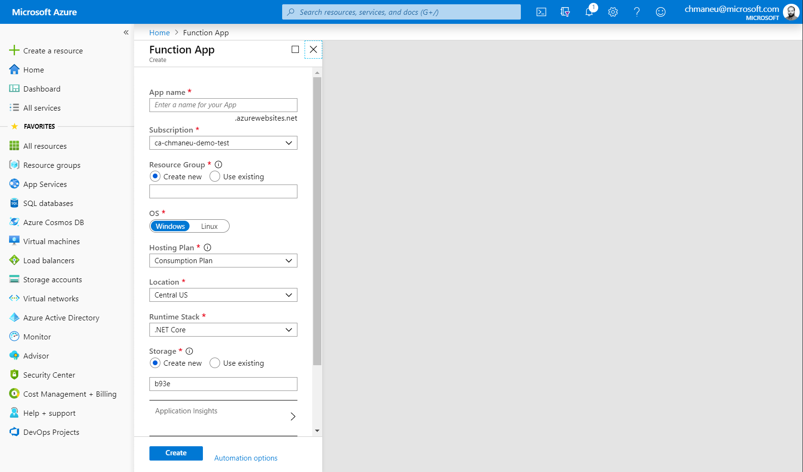
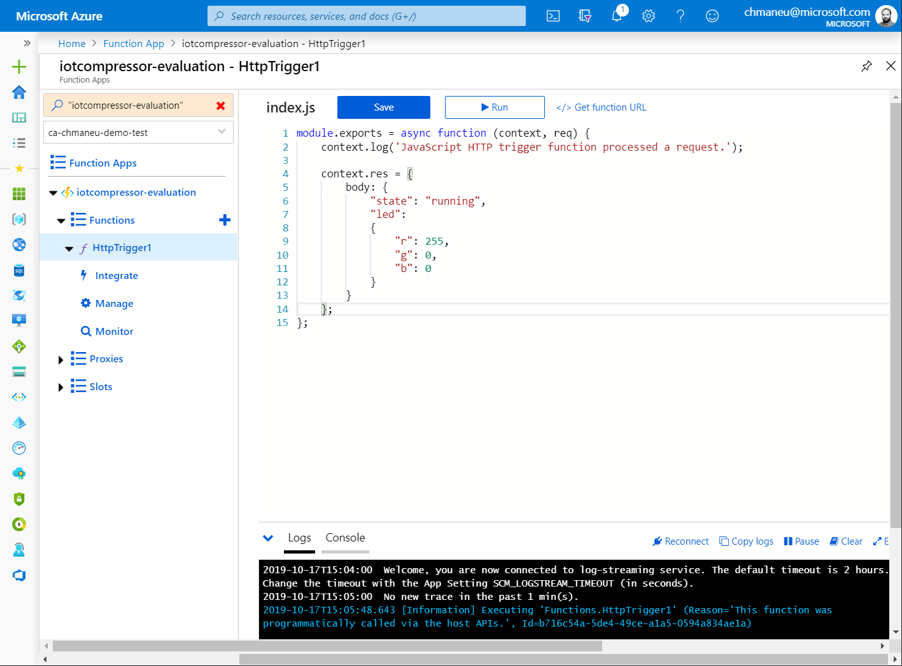

# Créer une Azure Function ⚡ dans le portail Azure 👩‍💻

Développer dans le portail n'est pas l'option recommandée pour un projet de production. 
Vous pouvez également [développer votre fonction dans Visual Studio Code](02-azure-function-detect-activity/create-function-portal.md).

## Créer l'application

Avant de créer une fonction, vous devez tout d'abord créer un application. Depuis le 
[portail Azure](https://portal.azure.com?wt.mc_id=blinkingcompressor-github-chmaneu)
, cliquez sur le bouton (+) en haut à gauche, recherchez "function" et choisissez "Function App". Vous pouvez également
utiliser le 
[lien direct](https://portal.azure.com/?feature.customportal=false&wt.mc_id=blinkingcompressor-github-chmaneu#create/Microsoft.FunctionApp)

Une fois sur l'assistant de création, vous aurez un certain nombre de questions auxquelles répondre: 

- **Un nom d'application**: ce nom servira également à générer une adresse en `mafonction.azurewebsites.net`. Il doit donc
être unique sur l'ensemble des utilisateurs d'Azure,
- **Un abonnement**: normalement, vous ne devriez avoir qu'un seul choix. Dans un contexte d'entreprise, il n'est pas rare
d'avoir plusieurs abonnements - pour séparer les environnements par exemple,
- **Un resource group**: chaque ressource dans Azure doit être placée dans un conteneur logique. C'est le resource group,
- **Un Système d'exploitation**: Windows ou Linux. Cela influencera la liste des langages supporté,
- **Un plan**: C'est le mode de déploiement de la fonction. Sélectionnez _Consommation/comsumption_, ce qui vous permet
d'avoir une facturation à l'usage, ainsi qu'un auto-scaling,
- **La stack**: Node.Js, Java, .NET Core, Python. Faites votre choix ! 
- **Un emplacement**: Cela correspond à la zone dans laquelle votre fonction sera déployée. On vous recommende _France 
Central_ ou _Europe de l'Ouest_,
- **Un stockage**: laissez l'assistant en créer un. Il sert notamment à aggréger les logs et synchroniser les différentes
instances qui hébergeront votre fonction.

Il vous suffit alors de cliquer sur le bouton **Create** pour lancer la création de l'application. Vous pouvez suivre
l'évolution en cliquant sur l'icône en forme de cloche en haut à droite.

?> Un nouvel écran de création d'une Function App est en cours de déploiement. Bien que le design ait changé, 
les questions
posées sont identiques.

Une fois l'application de function créée, vous serez alors en mesure de créer votre première fonction. Dans l'assistant
qui s'affiche, sélectionnez le mode d'édition **In-portal**. On vous proposera alors un type de modèle, choisissez
_Webhook + API_.

## Coder et tester dans le navigateur

Vous aurez alors accès à un éditeur de code. Le bouton "Save" vous permet d'enregistrer vos modifications sur le serveur
et de les déployer directement. Le bouton "Run" vous permet d'exécuter votre fonction, tout en voyant les logs en bas 
de la page et la requête à exécuter à droite.

!> Les raccourcis claviers, comme _Ctrl+S_ ne fonctionnent pas dans le navigateur. Oui c'est assez frustrant :).

Vous pouvez maintenant passer à l'étape de [coder la fonction de prédiction d'activité du compresseur](02-azure-function-detect-activity/write-function-code.md).