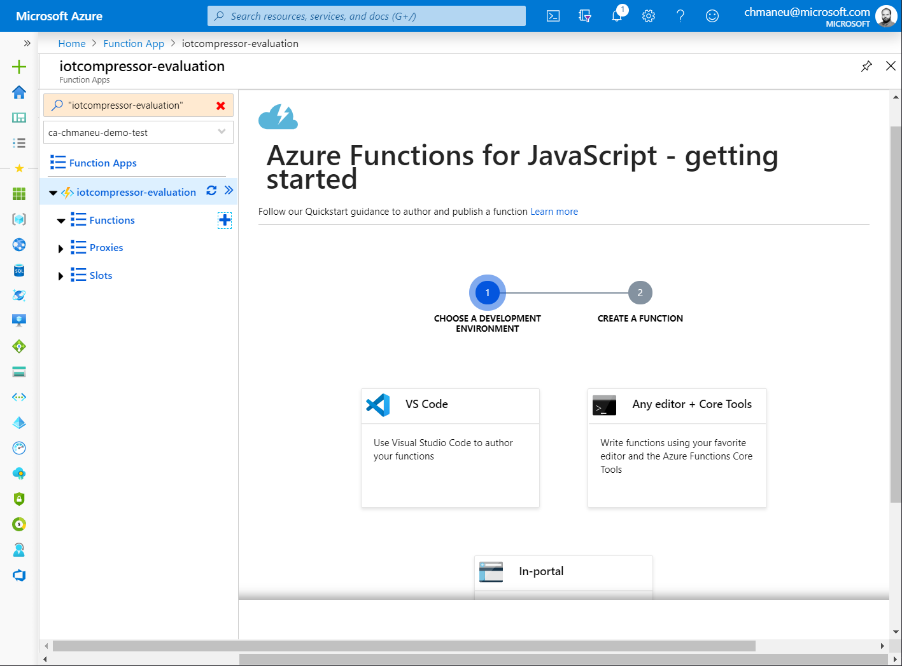
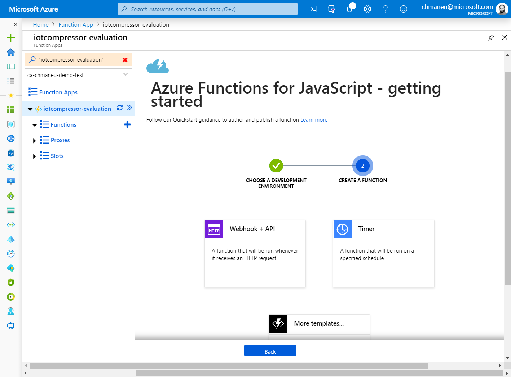
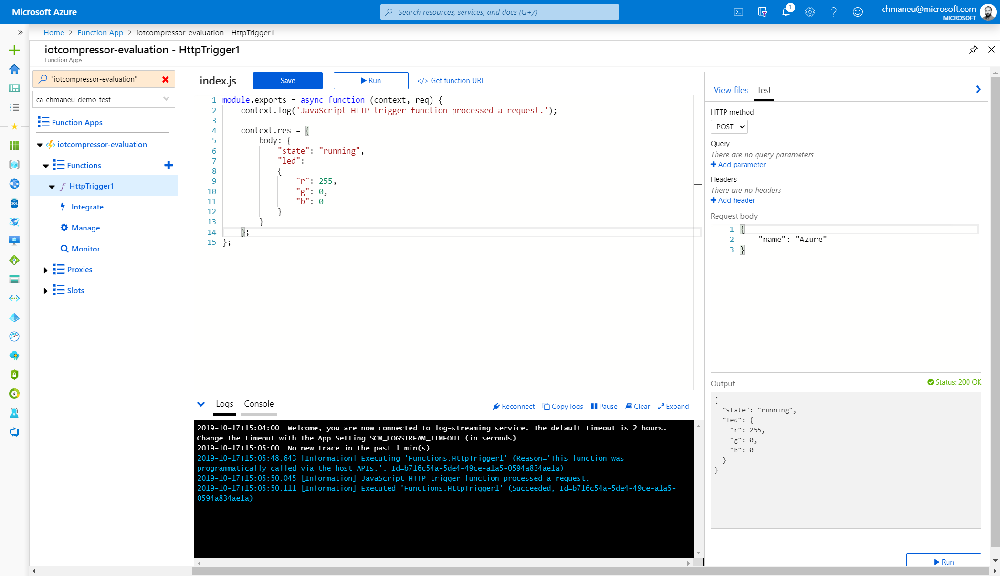
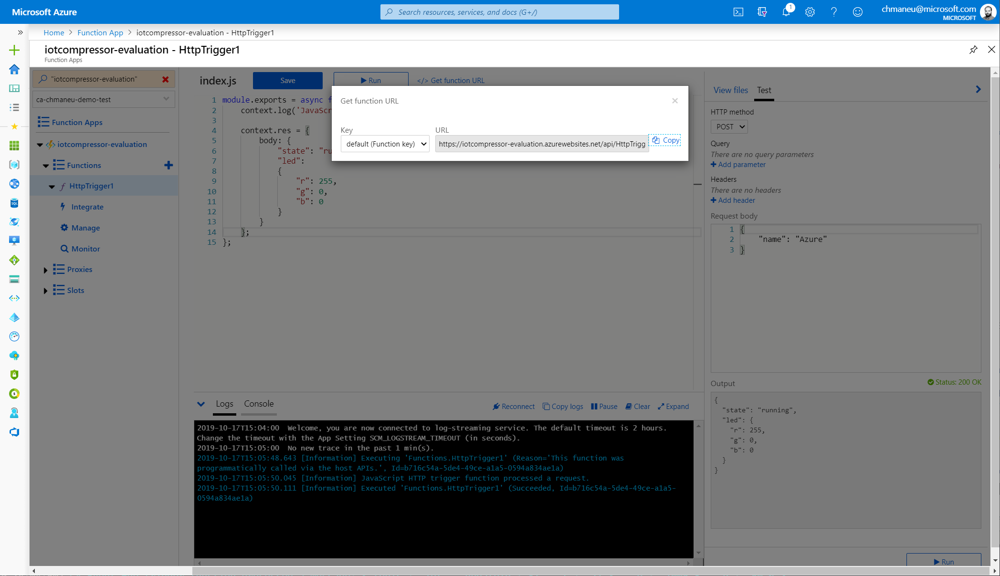

# Créer une Azure Function ⚡ dans le portail Azure 👩‍💻

Développer dans le portail n'est pas l'option recommandée pour un projet de production. 
Vous pouvez également [développer votre fonction dans Visual Studio Code](02-azure-function-detect-activity/create-function-portal.md).

## Créer le projet

[Lien direct](https://portal.azure.com/?feature.customportal=false&wt.mc_id=devroadshowiot-github-chmaneu#create/Microsoft.FunctionApp)

?> Un nouvel écran de création d'une Function App est en cours de déploiement. Bien que le design ait changé, les questions
posées sont identiques.

- **Un nom d'application**
- **Un abonnement**
- **Un resource group**
- **Un Système d'exploitation**
- **Un plan** Consommation/comsumption
- **La stack**: Node.Js, Java, .NET Core, Python
- **Un emplacement**: France Central ou Europe de l'Ouest
- **Un stockage**: laissez l'assistant en créer un.

## Coder et tester dans le navigateur

