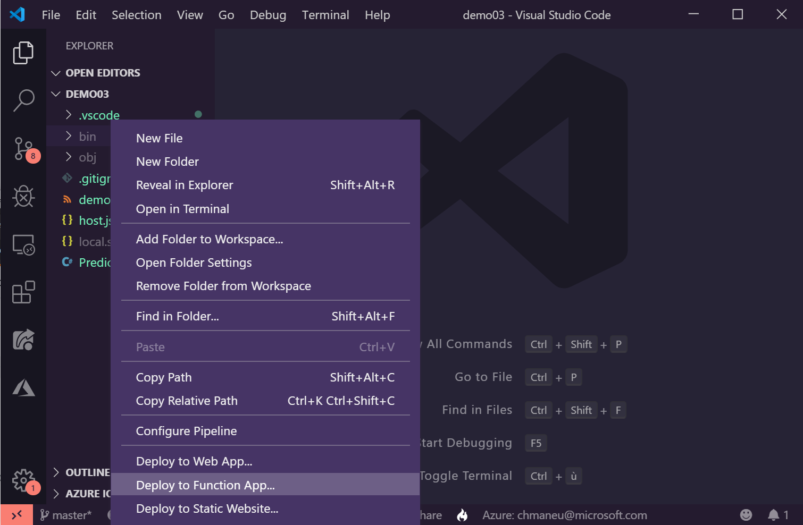
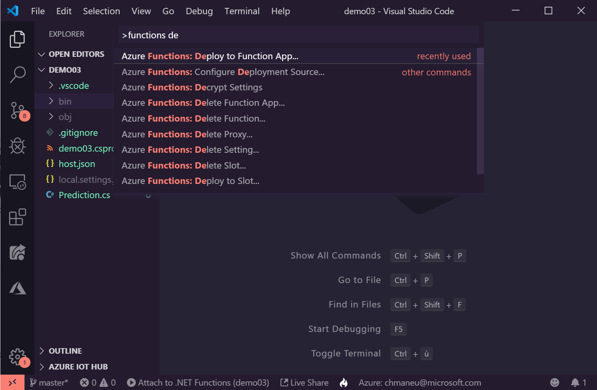
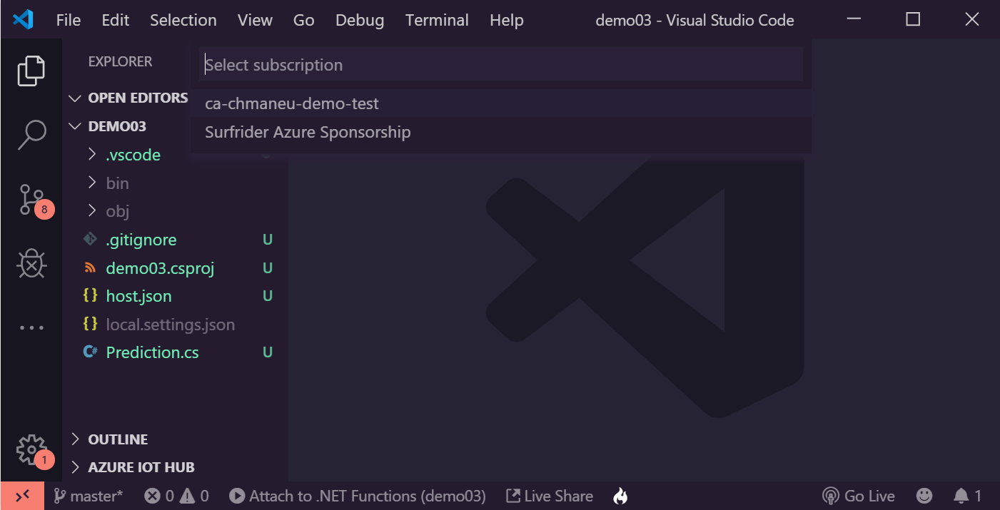
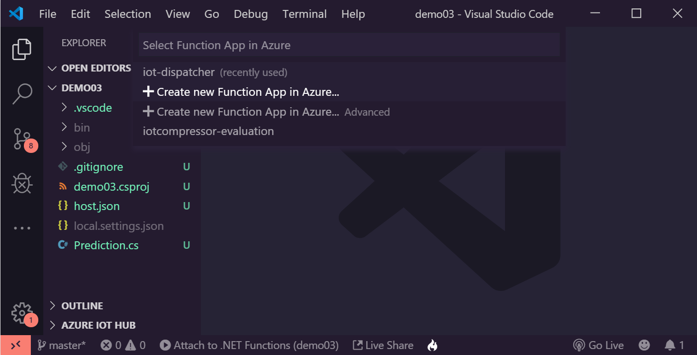
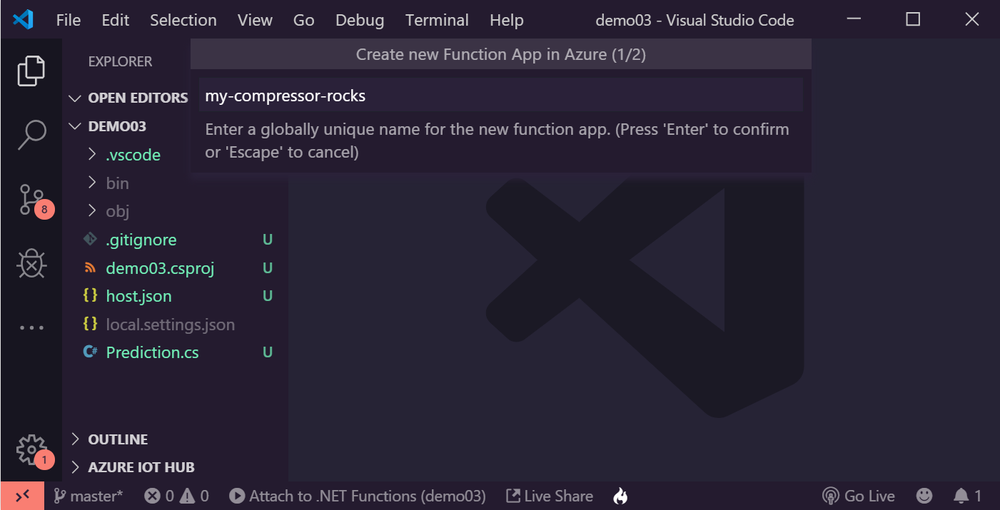
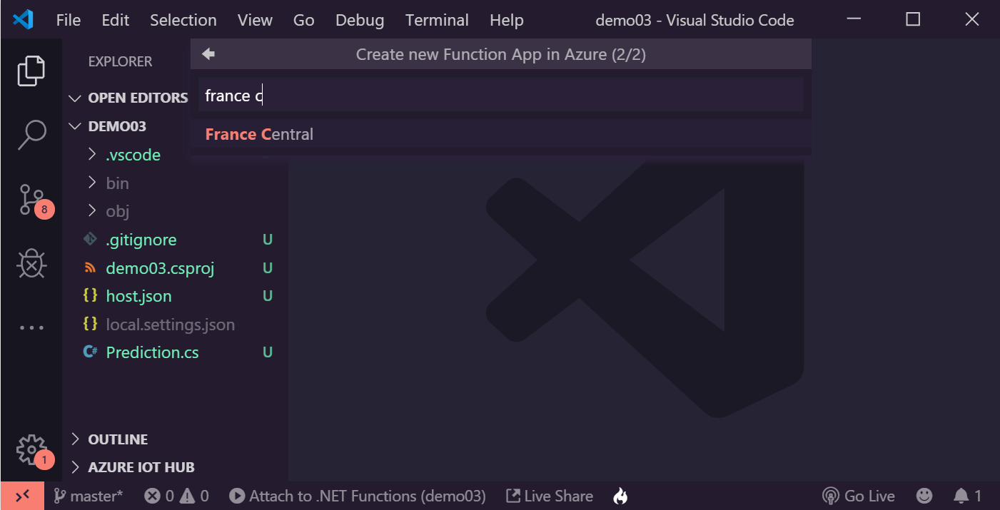
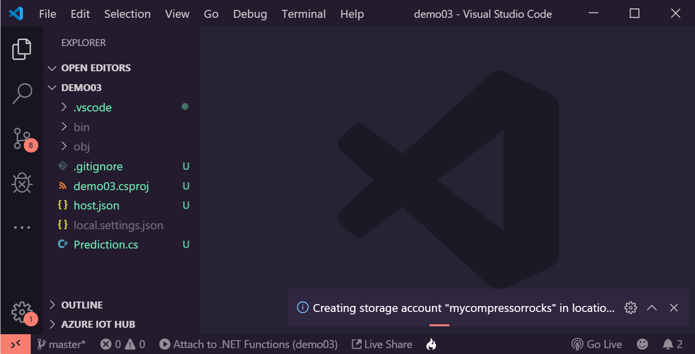
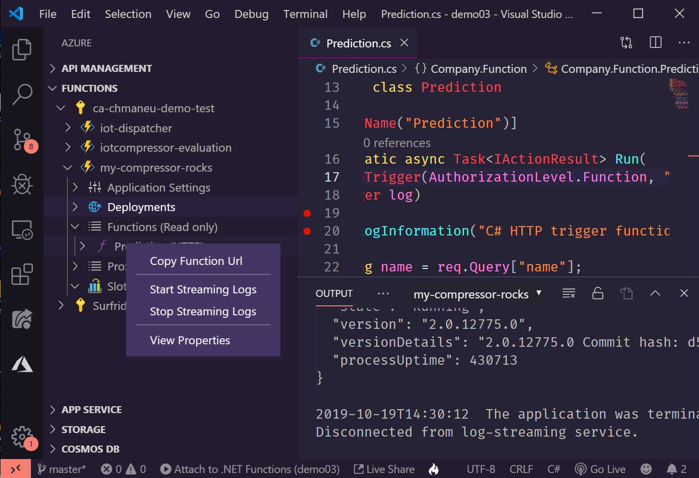
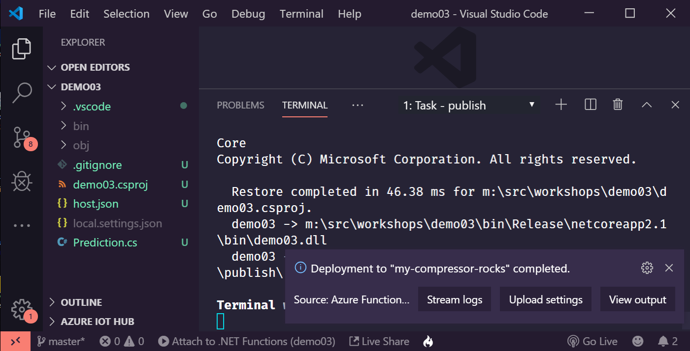

# Déployez votre fonction dans Azure ☁️

Votre fonction est désormais prête pour le prime time ? Allons la déployer sur Azure !

?> Comme indiqué précédemment, nous allons ici la déployer sur Azure, mais nous pourrions la déployer
sur d'autres environnements.

## Vous l'avez développé dans le portail Azure

Si vous avez écrit votre fonction depuis le portail Azure, alors elle est automatiquement déployée à chaque fois que
vous appuyez sur le bouton "Save". Vous n'avez donc rien à faire !

## Déployer depuis Visual Studio Code

Si vous avez créé votre projet depuis Visual Studio Code, vous allez pouvoir de déployer directement depuis l'éditeur.
Pour cela, deux options : 
- Dans le menu contextuel sur l'arborescence, avec l'option **Deploy to Function app**,
- Depuis la barre de commandes avec la commande **Azure Functions: Deploy to Function app**.

Quel que ce choix de départ, la suite des étapes est identique.

!> Si vous n'avez jamais utilisé Azure avec Visual Studio Code, il faudra connecter votre compte Azure à VS Code.
Un navigateur web devrait alors d'ouvrir vous demandant de vous connecter à votre compte Azure.

L'assistanv de VS code va alors vous poser un certain nombre de quesitons : 

- **Dans quel abonnement déployer l'application**: normalement, vous ne devriez avoir qu'un seul choix. Dans un contexte 
d'entreprise, il n'est pas rare d'avoir plusieurs abonnements - pour séparer les environnements par exemple,
- **Dans quelle Function app?**: nous allons ici en créer une nouvelle,
- **Un nom d'application**: ce nom servira également à générer une adresse en `mafonction.azurewebsites.net`. Il doit donc
être unique sur l'ensemble des utilisateurs d'Azure,
- **Un emplacement**: Cela correspond à la zone dans laquelle votre fonction sera déployée. On vous recommende _France 
Central_ ou _Europe de l'Ouest_,

VS Code va alors déployer l'ensemble des ressources nécessaires à l'hébergement de votre application, puis déployer
votre code dans cette application. Cela peut prendre quelques minutes.

?> Si vous avez effectué une modification de code et que vous souhaitez déployer une mise à jour, il suffit de suivre
les mêmes étapes, mais en sélectionnant l'applicaiton Azure Function déjà créée dans la liste.

## Déployer depuis la ligne de commande ou la CD/CI

En environnement de production, il est rare de déployer ces ressources via un clic-droit. Il est possible de déployer
des Azure Functions depuis une ligne de commande ou bien depuis un pipeline de CD/CI.

## Récupérer l'URL de la fonction

Via la barre "Azure" (celle avec un logo A dans la barre latérale gauche), il est possible d'explorer l'ensemble des
Azure Functions de ses souscriptions. Un clic droit sur la fonction permet alors de récupérer l'URL à appeler.

Si vous avez choisi un mode d'autentification `Function`, cette URL contiendra alors directement la clé d'API.

## Streamer les logs depuis Azure

Une fois votre fonction déployée, il est possible de streamer ces logs directement depuis Visual Studio Code.
Pour cela, il suffit de cliquer sur le bouton dans la notification ou d'utiliser la commande 
**Azure Functions: Start Streaming Logs**.

