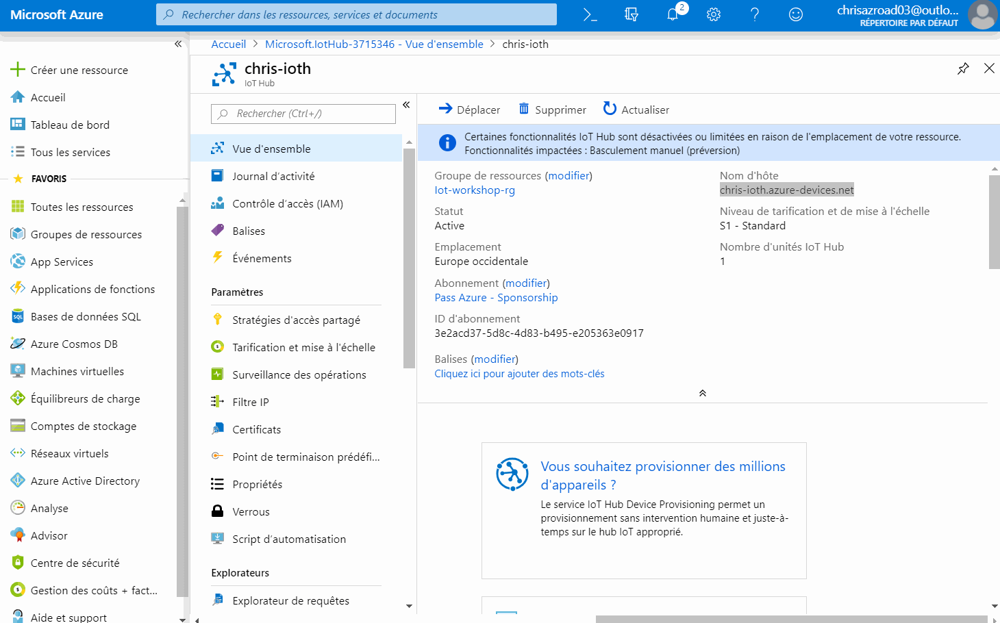
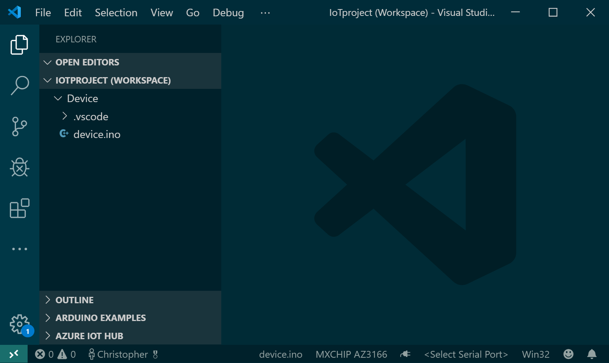
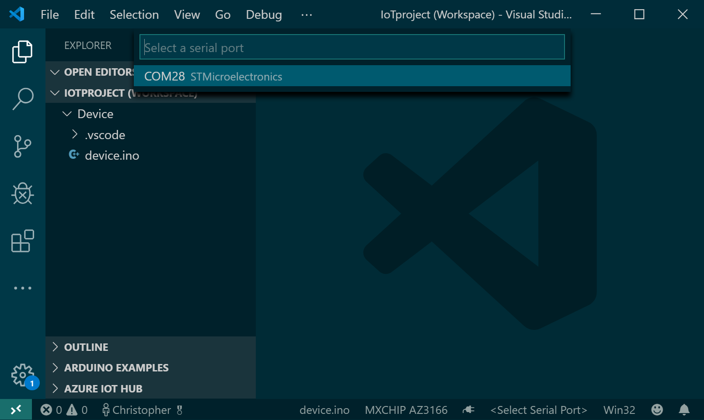

# Connecter votre carte IoT à IoT Hub 🔌

## Créer un _device_ dans l'IoT Hub

Au sein du IoT Hub, chacun de vos périphériques IoT se doit d'être déclaré afin de pouvoir le gérer et accepter des 
données. Pour cet atelier simple, nous allons ajouter le périphérique à la main. Si nous avions à déployer des millions 
de périphériques, il y a bien évidemment [une solution][docs-deviceprov] :) Et comme tout service Azure, il existe une
API Rest - et souvent un SDK - qui permet [d'automatiser certaines tâches](https://github.com/cmaneu/Azure-Blinking-IoT-Compressor/blob/master/src/functions-dispatcher/CreateDevice.cs).

La création d'un device IoT dans le portail est assez simple. Naviguez jusqu'à l'onglet **Appareils IoT** (IoT Devices), puis cliquez 
sur **Ajouter**. Vous avez alors simplement à donner un nom à votre périphérique. Pour notre workshop, il n'y a bas besoin de 
configurer les autres options. 

Lorsque vous vous rendez sur l'écran de votre appareil IoT - en cliquant sur son nom - , vous aurez accès à deux clés ainsi que 
les chaînes de connexion correspondantes. **Ce sont elles qui permettent de sécuriser la connexion entre votre appareil et Azure**. 

!> Il est important **de ne pas les diffuser ou les mettre dans votre code source (ou repository Github)**. Nous verrons juste 
après comment la déployer sur la carte.

?> **Pourquoi il y a-t-il deux clés et non pas une ?** C'est pour permettre la rotation de clés, une bonne pratique en matière de 
sécurité.

**Notez cette clé d'accès quelque part** ou gardez la fenêtre ouverte, nous allons l'utiliser dans quelques instants.

## Configurer la chaîne de connection sur votre board

Il faut maintenant _donner_ cette clé d'accès à la board. Il existe un emplacement mémoire spécifique permettant de
contenir ce genre d'informations. 

?> La board _MXChip_ possède une puce de sécurité, permettant notamment de protéger ce genre de secrets, y compris
si le firmware était corrompu. Sa mise en oeuvre prendrait un peu de temps, et elle est irréversible. Les boards
que nous vous prêtons pour le workshop étant réutilisées, nous n'utiliserons pas cette fonctionnalité.

Visual Studio Code a une fonctionnalité vous permettant très simplement d'uploader sur la board cette configuration.
Cependant, celle-ci n'est disponible que lorsque vous avez un projet _IoT Workbench_. Nous allons créer un projet
"vide". Ouvrez une nouvelle instance de Visual Studio Code, et effectuez les étapes suivantes: 

- **Azure IoT Device Workbench: Create Project...**
- Donner un nom
- Le type de board, sélectionner **Arduino**
- Template de projet: choisir **MXChip IoT DevKit with Azure IoT Hub**

Assurez-vous que Visual Studio a bien sélectionné votre type de board ainsi que le port série (émulé via l'USB).
Vous pouvez voir en bas à droite le port sélectionné. Sur l'image ci-dessous, aucun port n'est sélectionné.

Cliquez sur `<Select Serial Port>` et sélectionnez le port COM avec la légende _ST Microelectronics_.

Le port sélectionné s'affiche alors en bas à droite.

Vous pouvez désormais uploader la chaîne de connexion sur la board. Pour se faire : 

1. Maintenez appuyé le bouton **A** puis appuyez et relâchez le bouton **reset** pour passer en mode configuration
2. A l'aide de la commande `Azure IoT Device Workbench: Configure Device Settings`, choisissez `Config Device Connection String`,
 puis `Input IoT Hub Device Connection String`, et collez la connection string complète générée au début de l'atelier.

Une notification de confirmation va apparaître dans Visual Studio Code. Vous pouvez maintenant redémarrer votre board.

## Tester la connexion entre les deux

Une fois que votre board a redémarrée - vous pouvez appuyer sur le bouton physique **reset** pour le forcer, vous pouvez voir sur l'écran de la board si les envois de messages sont réussis. Le message `Update #99 sent` 
apparaît alors (avec un numéro séquentiel à la place de 99).

Dans la prochaine étape, nous allons reconnecter votre Azure Function avec IoT Hub pour qu'elle 
traite les messages.

[docs-deviceprov]: https://docs.microsoft.com/fr-fr/azure/iot-dps/?wt.mc_id=devroadshowiot-github-chmaneu