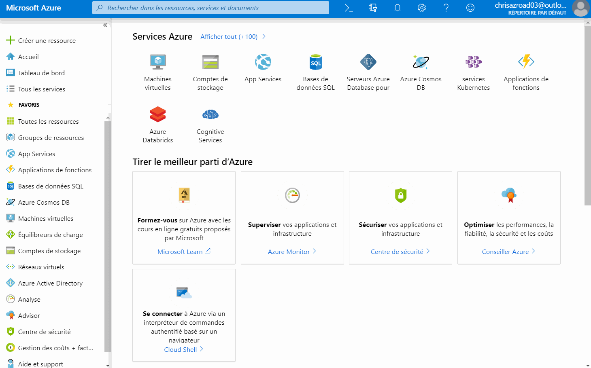

# Créer un IoT Hub

L'IoT Hub est un service qui vous permet de gérer la connexion entre vos devices IoT et vos services hébergés sur Azure 
(ou ailleurs). Plus concrètement, il vous permet : 

- D'identifier et de recevoir des données de vos périphériques IoT - on appelle cela le _Device To Cloud_,
- D'envoyer ces données à différents applicatifs,
- De transmettre des commandes ou des données du cloud vers vos périphériques - c'est le _Cloud To Device_, 
- De mettre à jour les micrologiciels à distance de vos périphériques, voire de déployer du code à distance.

La vidéo suivante nous montre comment créer un nouveau IoT Hub. Choisissez bien le groupe de ressources créé à l'étape 
précédente, puis choisissez la région (Europe occidentale) puis un nom.

> Comme beaucoup de ressources dans Azure, leur nom devient une partie d'une adresse Internet - ici 
`monhub.chris-ioth.azure-devices.net`. Il doit donc être unique à tous les utilisateurs d'Azure !

A l'étape d'après, vous serez amené à choisir un niveau de tarification (_tier_) et une mise à l'échelle. Pour cet 
atelier, nous choisirons la taille **S1: Niveau Standard**.

> Il existe à aujourd'hui trois tiers. Le tiers gratuit est limité en nombre de messages, alors que le tiers basique ne 
dispose pas des fonctionnalités _Cloud to Device_ ou _Device Twins_ que nous allons utiliser plus loin. Le nombre 
d'unités permet quand à lui de supporter un plus grand nombre de périphériques IoT.

Maintenant que votre hub est créé, il vous reste à effectuer deux étapes : 

- Connecter votre carte à l'IoT Hub que vous venez de créer
- Traiter les messages reçus par votre IoT Hub 