# Traiter les événement du Hub avec Azure Functions

Jusqu'à présent, nous vous avions abstrait une partie de la complexité - et des services - 
nécessaires pour réaliser l'architecture. Comme vous pouvez le voir sur le schéma ci-dessous,
une Azure Function ne peut pas consommer directement des messages provenant de l'IoT Hub.

Pour se faire, nous devons passer par un autre service, **Azure Event Hubs**. C'est un service
d'ingestion de données en temps réel, simple et hautement scalable (on peut parler facilement
de millions d'événements par seconde). L'API est propriétaire (avec des SDK opensources pour
de nombreux langages), mais il est également possible de l'utiliser avec une API Kafka 
(Event Hubs peut donc être utilisé comme un service Kafka entièrement managé !).

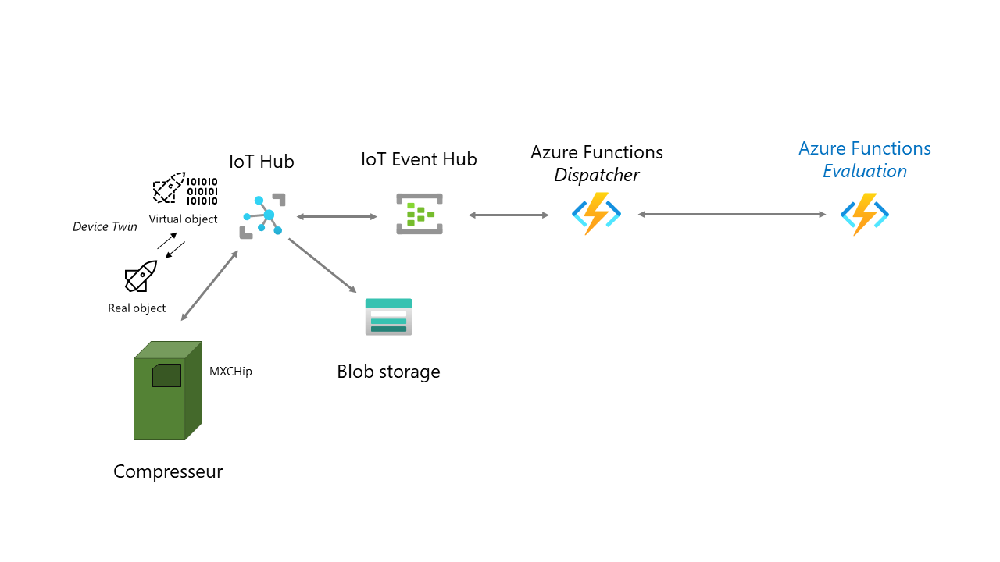

## Créer un Event Hub

Pour utiliser un event hub, vous avez besoin de deux composants : 

- Un Namespace : C'est un conteneur pour un Event Hub (tel qu'un topic kafka). 
- Un Event Hub : C'est l'unité de scaling/processing des messages.

Commencez par créer un namespace, via le menu de création de ressources. Vous pouvez choisir
le même ressource group que précédemment. Choisissez également la même région que celle de votre IoT Hub
et Azure Function. 

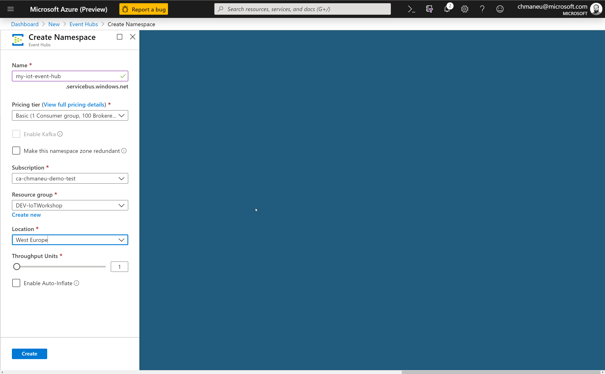

Une fois créé, il vous faudra alors créer l'Event Hub. Vous pouvez le faire via le bouton **+ Event Hub** sur
la ressource Namespace.

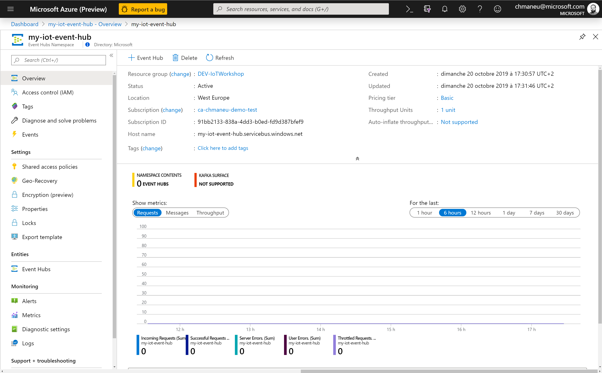
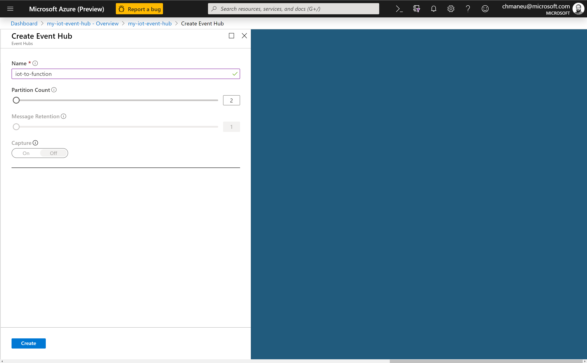

## Configurer l'envoi des messages de l'IoT Hub vers l'Event Hub

Nous allons maintenant indiquer à l'IoT Hub qu'il doit envoyer les données qu'il reçoit
vers l'Event Hub que nous avons créé. Pour cela, retournez sur votre ressource IoT Hub, et
cliquez sur **Message routing** dans le menu de gauche.


> L'exercice ici est très simple. Pour un déploiement en production, il faudrait ajuster un certain nombre
de paramètres en fonction du nombre de devices ainsi que du nombre de flux consommant les données
de l'IoT Hub - et notamment avoir le nombre de partitions en conséquence.

Vous pouvez alors ajouter une route. Il faudra choisir un nouveau endpoint de type Event Hubs.
Assurez-vous de router les messages de type `Device Telemetry Message`.

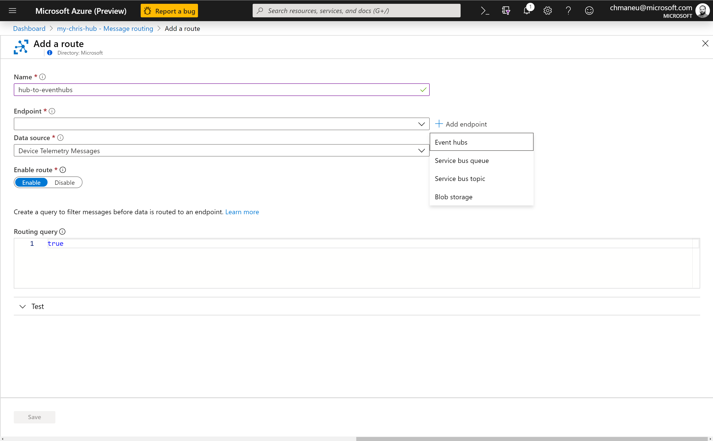
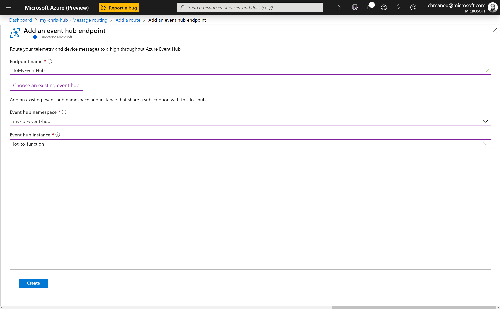

A partir de maintenant, tous les messages reçus des devices par l'IoT Hub seront renvoyés
vers l'Event hubs.

> Vous avez un peu de temps ? Créez un compte de stockage, et une route supplémentaire afin
d'envoyer également les messages sur un stockage à froid pour une analyse à postériori.

## Développer l'Azure Function pour consommer les messages de l'Event Hub

Il nous faut désormais consommer les messages provanent de l'Event Hub. Le plus simple pour cela
est de créer une nouvelle fonction - par exemple dans la même app que celle créée lors du module 2.

Vous pouvez reprendre votre projet Azure Functions et refaire les étapes en sélectionnant le trigger
`Event Hubs`. Visual Studio Code vous proposera alors de sélectionner l'Event Hub que vous souhaitez 
consommer.

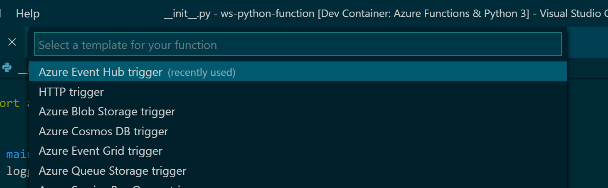
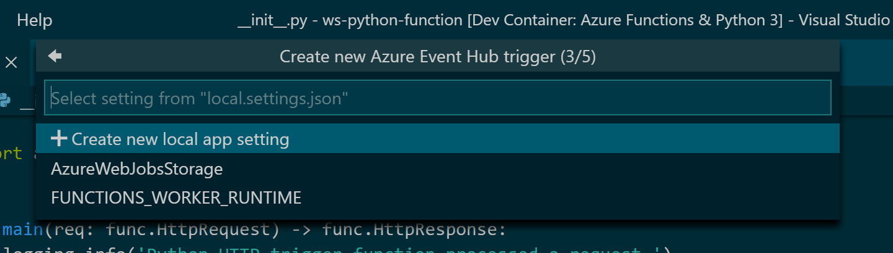
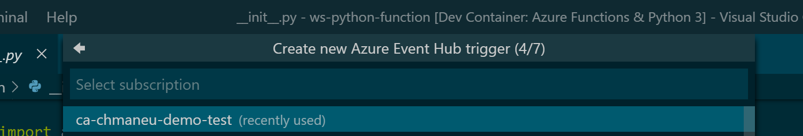
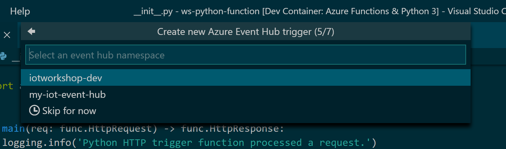

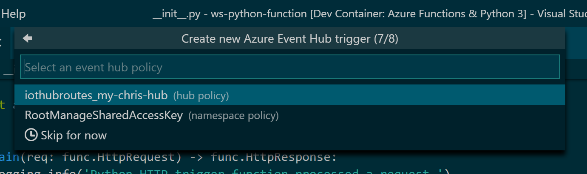
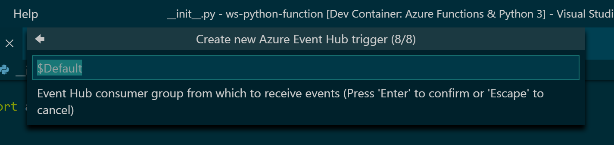

Vous pouvez réutiliser le code créé lors du module 2, mais avec quelques adaptations :).
Tout d'abord, le message que vous allez recevoir a un format différent de celui reçu au module 2.
Voici un exemple de JSON que vous allez reçevoir : 

```json
{
    "Topic": "iot", 
    "t": 25.5,
    "p": 1003.3,
    "h": 56.3
}
```

La seconde partie de code à modifier est la partie retour. Dans le module 2, vous aviez simplement
à retourner un JSON au service et la LED sur la board changeait de couleur. Pour cet exercice, il faudra
faire un peu plus de code :). Vous allez devoir modifier le Device Twin vous-même, à l'aide d'un des SDK
Service IoT Hub.

> Il existe deux types de SDK IoT Hub :
> - Le _Device SDK_, pour être utilisé côté objet connecté
> - Le _Service SDK_, pour être utilisé par les applications métiers ayant besoin de communiquer
> avec l'IoT Hub.
> 
> C'est ce second qu'il faudra utiliser. A ce propos, il existe deux chaines de connexion distinctes.
> Une pour le device - que vous avez déjà utilisé - et une autre pour le Service SDK. 

Commencez par choisir le [SDK correspondant au langage de votre Azure Function](https://docs.microsoft.com/en-us/azure/iot-hub/iot-hub-devguide-sdks?wt.mc_id=blinkingcompressor-github-chmaneu#azure-iot-hub-service-sdks). A ce jour, il existe des SDKs pour Java, NodeJS, Python, .Net, C et iOs. N'hésitez pas à consulter les fichiers
`README.md` propres à chaque SDK afin de voir comment les appeler dans votre code.

Quelque soit le SDK utilisé, le principe est le même: nous allons modifier le _device twin_ de
votre board dans IoT Hub, et laisser IoT Hub appliquer la modification sur le périphérique. 
Ce device twin, qui est au format JSON, devra ressembler à cela : 

```json
{
    "properties":
    {
        "desired": 
            {
                "led": 
                {
                    "r": 100,
                    "g": 100,
                    "b": 0
                }
            }
    }
}
```

Dans votre code, il y aura alors trois étapes à réaliser : 

1. Récupérer une instance du _Registry Manager_, une connection à l'IoT Hub,
2. Récupérer la valeur actuelle du Device Twin correspondant à votre board,
3. Demander une update de ce Device Twin.

Voici un exemple de code C# permettant de réaliser ces trois étapes.

```csharp
// Etape 1 - Instance Registry Manager
string connectionString = Environment.GetEnvironmentVariable("iotHubConnectionString");
RegistryManager registryManager = RegistryManager.CreateFromConnectionString(connectionString);

// Etape 2 - Récupération du twin actuel
var twin = await registryManager.GetTwinAsync(deviceName);

// Etape 3 - Modification du twin
var patch = new
{
    properties = new
    {
        desired = new
        {
            led = new 
            {
                r = ledR,
                g = ledG,
                b = ledB
            }
        }
    }
};
await registryManager.UpdateTwinAsync(twin.DeviceId, JsonConvert.SerializeObject(patch), twin.ETag);
```

Une fois cette dernière étape réalisée, vous devriez être en mesure de traiter le message reçu de l'Event Hub
puis de modifier le device twin en fonction de votre super algorithme, et ainsi changer la couleur de la LED
par vous même. 
