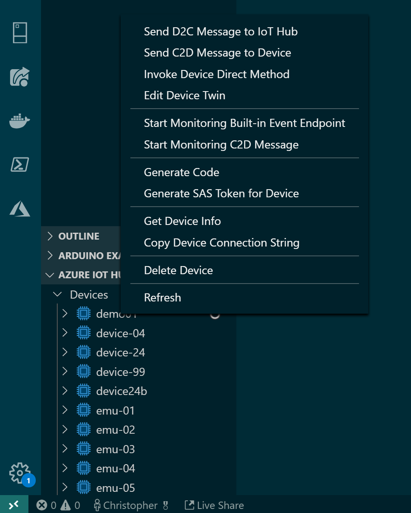

# Etape Bonus - Simuler des devices IoT sans matériel

Vous avez fini le workshop en avance ? Vous en voulez encore ? 
Nous avons pensés à vous ! Nous allons voir comment nous pouvons simuler des devices.
En effet, on voit mal comment un développeur pourrait avoir un compresseur dans un 
openspace pour développer sa solution IoT. C'est le cas pour de nombreux objets connectés.

Il existe différentes manière de simuler des devices IoT, notamment : 
- Utiliser Visual Studio Code et IoT Hub Toolkit pour envoyer des messages
- Coder son propre simulateur 

?> Ce module _bonus_ n'est pas aussi détaillé que les précédents. Mais nous sommes là
et la documentation également. A vous de jouer !

## Simuler avec Visual Studio Code et IoT Hub Toolkit

Si vous ouvrez un projet IoT (comme celui que vous avez créés pendant le module 3),
vous pourrez voir dans l'onglet explorateur la liste des devices. Via un clic droit,
vous aurez alors la possibilité d'envoyer un message à la place du device, 
ou d'écouter les changement de valeurs des device twins.

!> On vous conseille fortement de créer des devices de test dans l'IoT Hub, 
afin de ne pas confondre entre un vrai device et un simulateur.



On vous laisse tester cette fonctionnalité pendant quelques minutes ;).

## Simuler avec du code

Cette simulation dans VS Code est utile pour des petits tests, mais peut s'avérer fastidieuse
pour des simulations plus complexes. C'est pourquoi il est possible de coder son propre simulateur.

Pour se faire, il suffit d'utiliser l'un des [device SDKs](https://docs.microsoft.com/en-us/azure/iot-hub/iot-hub-devguide-sdks#azure-iot-hub-device-sdks?wt.mc_id=blinkingsimulator-github-chmaneu) dans
un nouveau projet (page web, application console, application mobile, etc...).

Vous pouvez alors coder une petite application qui va envoyer toutes les 5 secondes un nouvel événement, 
en respectant le format suivant. A vous de faire varier les différentes valeurs.

```json
{
    "Topic": "iot", 
    "t": 25.5,
    "p": 1003.3,
    "h": 56.3
}
```

Vous avez codé votre simulateur ? Modifiez-le pour ne pas simuler un seul périphérique
mais plusieurs...10, 100, 1000... :)