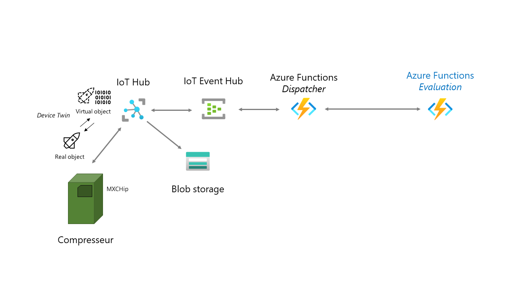

# Workshop "Azure Blinking IoT Compressor"

Bienvenue dans le workshop Azure IoT "Blinking Compressor".
L'objectif de ce workshop est de vous faire découvrir les bases de la création
de solutions IoT avec le cloud Microsoft Azure.

## Ce que vous allez apprendre

- Créer une souscription Azure,
- Créer et déployer une Azure Function,
- Connectez des devices IoT au Cloud,
- Simuler des devices IoT depuis votre PC,
- Et bien d'autres choses !

## Ce dont vous avez besoin pour ce workshop

- Un ordinateur (PC, Mac, Linux), avec un certain nombre de logiciels
- Une souscription Azure,
- Pour les modules utilisant du matériel, une board [Mx Chip][mxchip], que vous pouvez [acheter en ligne][mxchip-buy]. Vous pouvez également réaliser les exercices avec [l'émulateur en ligne](https://azure-samples.github.io/iot-devkit-web-simulator/).

## Le contexte

Mon club de plongée a besoin de vous ! Afin de remplir nos bouteilles de plongées, nous avons un compresseur d'air
pouvant monter jusqu'à 300 bar. Voici à quoi cela ressemble.

Afin que cet équipement continue de fonctionner et d'avoir un air de qualité, nous avons besoin de réaliser 
régulièrement des opérations de maintenance dessus (changement des filtres, révisions, etc...). Pour savoir quand
les réaliser, il suffit _normalement_ de consulter le **logbook** de l'appareil. Aujourd'hui, c'est simplement un 
classeur papier dans lequel chaque utilisateur doit noter un certain nombre d'informations, permettant de connaître 
le temps de fonctionnement.

Mais voilà: la plupart des utilisateurs sont des bénévoles. La partie administrative n'est pas celle qu'ils préfèrent le
plus :angel:. Ce n'est pas rare de constater que ce classeur n'a pas été rempli depuis plusieurs semaines ! Et si les solutions IoT pouvaient nous aider ?

Nous allons donc faire de l'**IoT Retrofitting** : trouver un moyen de "connecter" un objet qui ne
l'est pas! L'objectif final est de remplir de manière automatique le _logbook_ à chaque fois
que le compresseur s'allume ou s'eteint. Pour se faire, nous allons utiliser les données des capteurs
de la borne - température, pression, accéléromètre, son, ... - pour faire cette détection.

[Commencer le workshop !](01-prepare-environment/index.md)

_Ce workshop a été réalisé par l'équipe des relations développeurs Microsoft France:_ 
- [@cmaneu](https://twitter.com/cmaneu) - Cloud Advocate,
- [@fbouteruche](https://twitter.com/fbouteruche) - Developer Relations.

[mxchip]: https://aka.ms/iot-devkit?wt.mc_id=blinkingcompressor-github-chmaneu
[mxchip-buy]: https://aka.ms/iot-devkit-purchase?wt.mc_id=blinkingcompressor-github-chmaneu