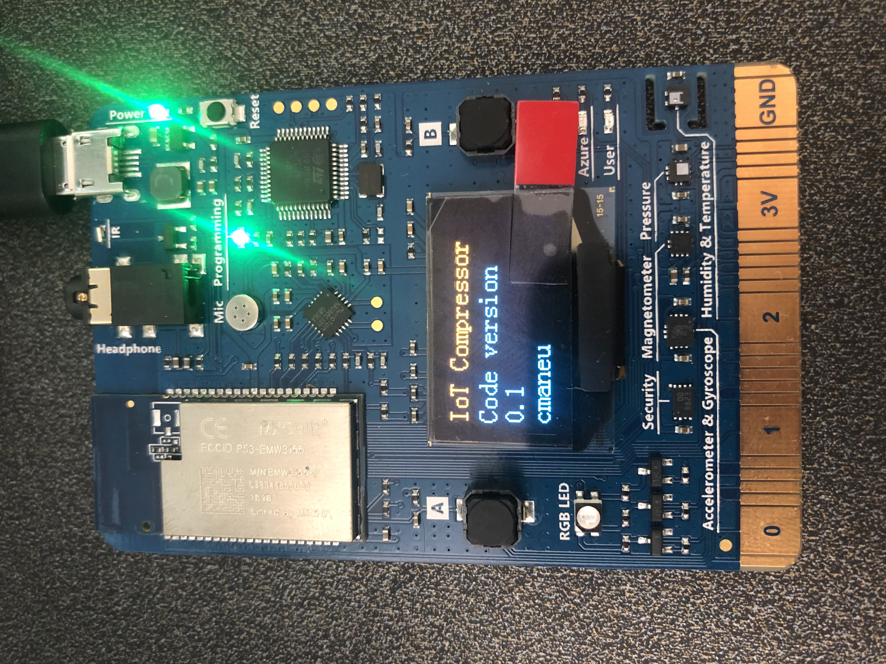
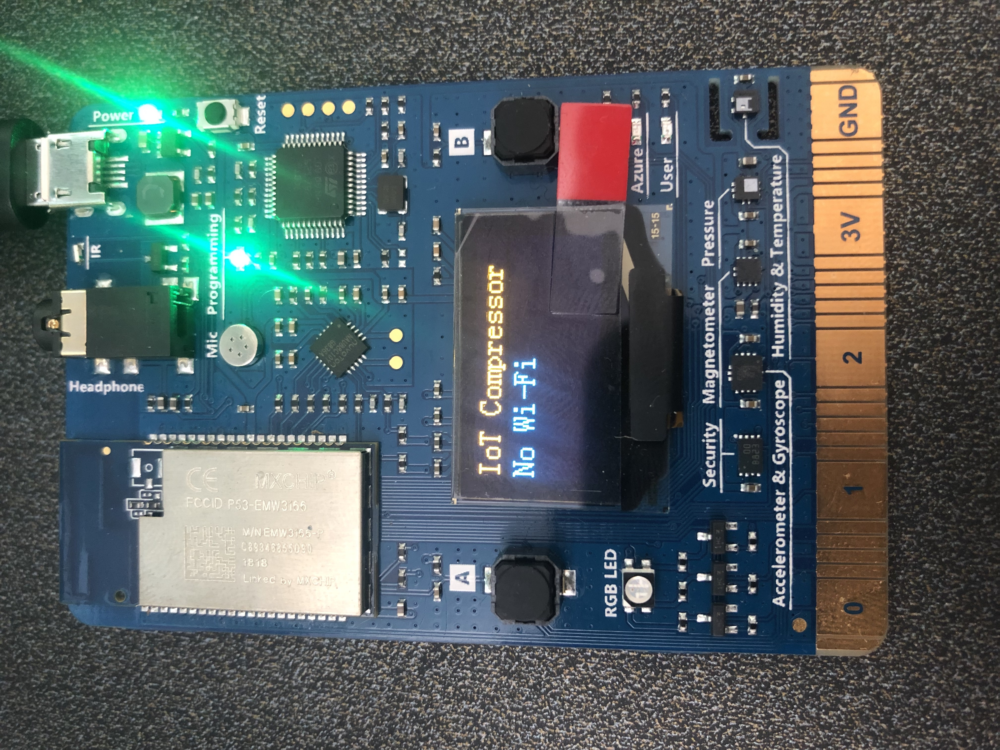
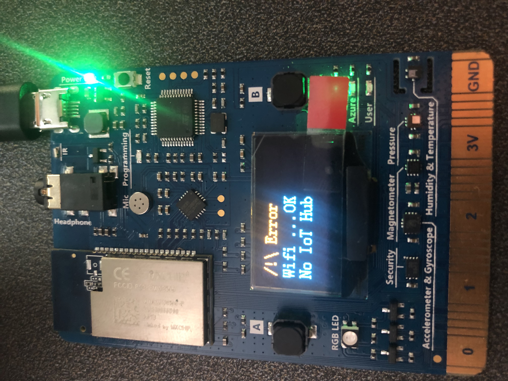
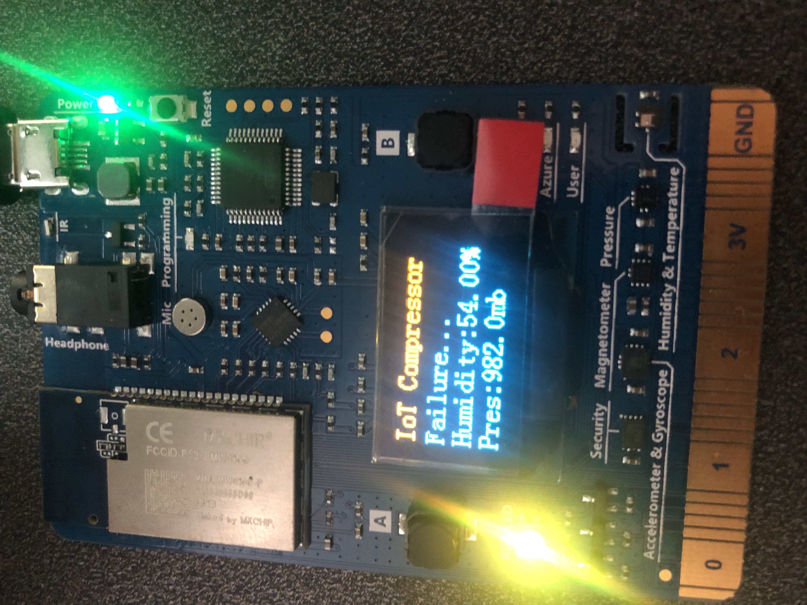
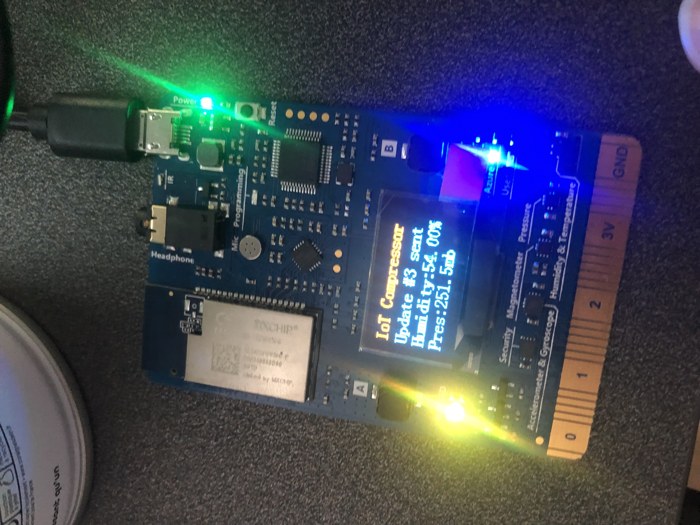

# FAQ - for proctors

## Understand board states

| Board picture | State         |
|---------------|---------------|
|  | Second screen of the boot screen. Displays code version. |
|  | The board is booting up. The LED will go from Red, to green to blue to off while booting |
|  | This means that neither the preconfigured Wifi, nor the selected wifi in WiFi mode is available. Restart in WiFi configuration mode. |
|  | There is some Wifi, but no connection to IoT Hub. Either the IoT Hub Connection string is incorrect, or there is no Internet behind that wifi. |
|  | The board is displaying `Failure...` message. The IoT Hub was not reachable, while WiFi was enabled. Check if Wifi has still access to Internet, and reboot the board. |
|  | The LED is on a green-yellow state after the first update sent. There is probably no webhook configured for that board. Check the webhook table. |
