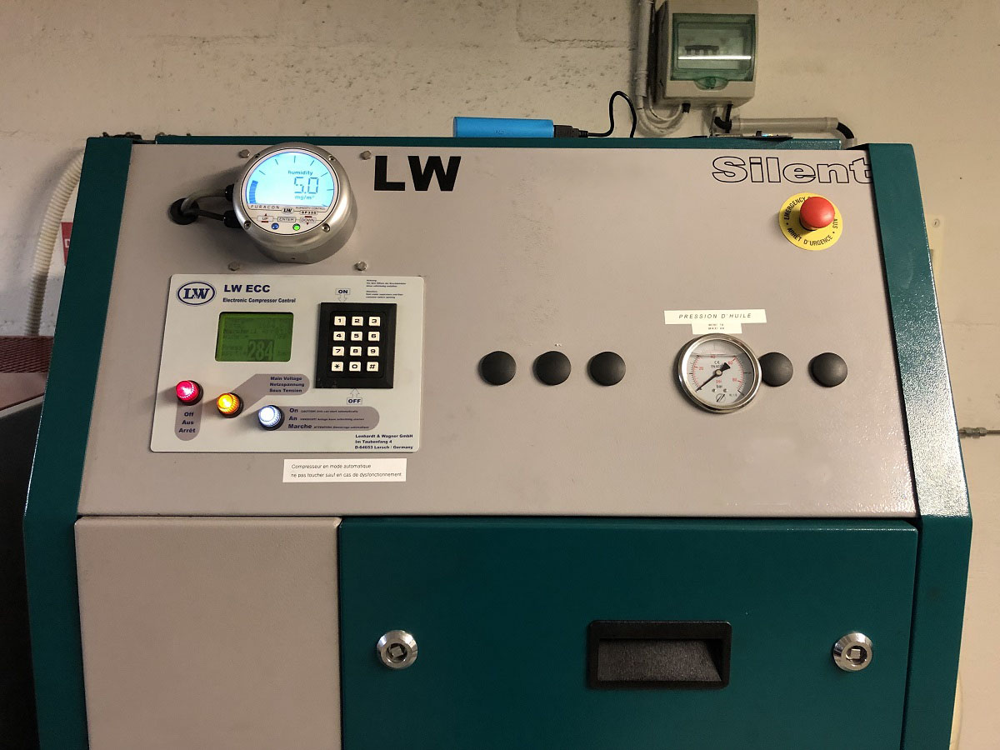

# Workshop "Azure Blinking IoT Compressor"

Bienvenue dans le workshop Azure IoT "Blinking Compressor".
L'objectif de ce workshop est de vous faire découvrir les bases de la création
de solutions IoT avec le cloud Microsoft Azure.

## Ce que vous allez apprendre

- Créer une souscription Azure,
- Créer et déployer une Azure Function,
- Connectez des devices IoT au Cloud,
- Simuler des devices IoT depuis votre PC,
- Et bien d'autres choses !

## Ce dont vous avez besoin pour ce workshop

- Un ordinateur (PC, Mac, Linux), avec un certain nombre de logiciels
- Une souscription Azure,
- Pour les modules utilisant du matériel, une board [Mx Chip][mxchip], que vous pouvez [acheter en ligne][mxchip-buy]. Vous pouvez également réaliser les exercices avec [l'émulateur en ligne](https://azure-samples.github.io/iot-devkit-web-simulator/).

## Le contexte

Mon club de plongée a besoin de vous ! Afin de remplir nos bouteilles de plongées, nous avons un compresseur d'air
pouvant monter jusqu'à 300 bar. Voici à quoi cela ressemble.



Afin que cet équipement continue de fonctionner et d'avoir un air de qualité, nous avons besoin de réaliser 
régulièrement des opérations de maintenance dessus (changement des filtres, révisions, etc...). Pour savoir quand
les réaliser, il suffit _normalement_ de consulter le **logbook** de l'appareil. Aujourd'hui, c'est simplement un 
classeur papier dans lequel chaque utilisateur doit noter un certain nombre d'informations, permettant de connaître 
le temps de fonctionnement.


Mais voilà: la plupart des utilisateurs sont des bénévoles. La partie administrative n'est pas celle qu'ils préfèrent le
plus :angel:. Ce n'est pas rare de constater que ce classeur n'a pas été rempli depuis plusieurs semaines ! Et si les solutions IoT pouvaient nous aider ?

Nous allons donc faire de l'**IoT Retrofitting** : trouver un moyen de "connecter" un objet qui ne
l'est pas! L'objectif final est de remplir de manière automatique le _logbook_ à chaque fois
que le compresseur s'allume ou s'eteint. Pour se faire, nous allons utiliser les données des capteurs
de la borne - température, pression, accéléromètre, son, ... - pour faire cette détection.


<div style="width: 200px; margin: auto; border:solid 2px blue; text-align: center; font-size: 140%; font-decoration: none !important; color: green !important; background-color: white;">

[Commencer le workshop !](01-prepare-environment/index.md)

</div>


<div style="text-align: center;">


</div>

_Ce workshop a été réalisé par l'équipe des relations développeurs Microsoft France:_ 
- [@cmaneu](https://twitter.com/cmaneu) - Cloud Advocate,
- [@fbouteruche](https://twitter.com/fbouteruche) - Developer Relations.


[mxchip]: https://aka.ms/iot-devkit?wt.mc_id=blinkingcompressor-github-chmaneu
[mxchip-buy]: https://aka.ms/iot-devkit-purchase?wt.mc_id=blinkingcompressor-github-chmaneu

---

# Créer un projet IoT Workbench

!> **Attention**: Ce module est en cours de rédaction.

## Créer le projet

## Ecrire du code pour le MxChip

Après la création du projet, vous aurez un fichier `device.ino`. Il contiendra seulement 
deux méthodes : 

- Une méthode `setup()` : 
- Une méthode `loop()` : 

```c
void loop() {
  // put your main code here, to run repeatedly:
  if (hasIoTHub && hasWifi)
  {
    char buff[128];

    // replace the following line with your data sent to Azure IoTHub
    snprintf(buff, 128, "{\"topic\":\"iot\"}");
    
    if (DevKitMQTTClient_SendEvent(buff))
    {
      Screen.print(1, "Sending...");
    }
    else
    {
      Screen.print(1, "Failure...");
    }
    delay(2000);
  }
}
```

---

# Préparez votre environnement

Afin de réaliser ce workshop, vous aurez besoin de deux éléménts : 

- Une souscription à Azure,
- Un ensemble d'outils, et notamment Visual Studio Code, afin d'écrire et 
de déployer du code à la fois sur un objet IoT et sur le cloud.

!> Vous lisez ce workshop sans être accompangé d'un employé Microsoft, certaines parties du workshop ne seront pas 
réalisables dans cet ordre. Nous sommes en train de préparer une nouvelle version qui vous permettra de le réaliser.

## Configurer le Wi-Fi de votre MX Chip

L'atelier IoT nécessite une connectivité Internet. Nous aurons normalement déjà configuré le Wifi, mais au cas où, voici la procédure à suivre.

1. Maintenir appuyé le bouton **B**, appuyer et relacher le bouton **Reset** , puis relâcher le bouton **B**. La board va alors passer en mode _configuration WiFi_. Pour se faire, il va lui-même diffuser un point d'accès auquel se connecter. L'écran affiche ainsi le SSID, ainsi que l'adresse IP à utiliser.

    

2. Connectez-vous au réseau WiFi indiqué sur la board. Si votre appareil demande un mot de passe, laissez-le vide.

    

3. Ouvrez **192.168.0.1** dans un navigateur. Sélectionnez le réseau sur lequel vous souhaitez vous connecter. Indiquez la clé WEP/WPA, puis cliquez sur **Connect**.

    

4. La board va redémarrer quelques secondes après. Elle affichera alors au démarrage le texte `Wifi...OK` après quelques instants.

    

## Configurer son environnement de développement

### Module Azure Functions

Pour le module _Détectez l'activité du compresseur avec une Azure Function_, 
il vous sera nécessaire d'installer les éléments suivants sur votre poste de 
développement: 

- [Visual Studio Code][vscode-home] ainsi que quelques extensions
    - L'extension [Azure Tools][vscode-azureext],
    - Les extensions pour les langages que vous allez utiliser
        - [C#][vscode-csharpext],
        - Python (**3.6** et non pas 3.7)
        - Java
        - JavaScript/NodeJS est déjà inclus :)

[vscode-home]: https://code.visualstudio.com/?wt.mc_id=blinkingcompressor-github-chmaneu
[vscode-azureext]: https://marketplace.visualstudio.com/items?itemName=ms-vscode.vscode-node-azure-pack&wt.mc_id=blinkingcompressor-github-chmaneu
[vscode-csharpext]: https://marketplace.visualstudio.com/items?itemName=ms-vscode.csharp&wt.mc_id=blinkingcompressor-github-chmaneu    

### Module _Connectez vos devices IoT au Cloud_

Pour ce module, vous aurez besoin d'un certain nombre de composants. Le MXChip étant une board Arduino,
il vous faudra installer pas mal de choses. Je vous conseille de lancer l'installation en parallèle de la réalisation
du second module. 

- [Visual Studio Code][vscode-home] ainsi que quelques extensions
    - L'extension [Azure IoT tools][vscode-iottoolsext] ([Installer](vscode:extension/vsciot-vscode.azure-iot-tools)), qui contient notamment _IoT Workbench_,
    - L'extension [Arduino][vscode-arduinoext] de l'éditeur Microsoft,
    
- [Arduino IDE][arduino-ide]: il contient les outils de builds et de déploiment pour la carte MXChip. **Attention:** Installez la version "standalone", et non pas la version du Store.
- Le driver _ST-Link_: 
	* Windows
	Télécharger et installer le driver depuis le site [STMicro](http://www.st.com/en/development-tools/stsw-link009.html).

	* macOS
	Pas de driver nécessaire

	* Ubuntu
  	Exécuter la commande suivante dans votre terminal, puis déconnectez/reconnectez-vous afin d'appliquer le changement 
    de permissions. Lisez la note ci-dessous avant.

		```bash
		# Copy the default rules. This grants permission to the group 'plugdev'
		sudo cp ~/.arduino15/packages/AZ3166/tools/openocd/0.10.0/linux/contrib/60-openocd.rules /etc/udev/rules.d/
		sudo udevadm control --reload-rules
		
		# Add yourself to the group 'plugdev'
		# Logout and log back in for the group to take effect
		sudo usermod -a -G plugdev $(whoami)
		```

?> Vous êtes sous Ubuntu ? Cette dernière étape est à réaliser à la fin de cette partie. En effet, le dossier 
`packages/AZ3166` est créé lors d'une prochaine étape.

Une fois l'ensemble de ces composants installés, il faudra s'assurer que Visual Studio Code puisse utiliser l'installation
d'Arduino. Ouvrir **File > Preference > Settings** et faites une recherche sur "Arduino". Vous verrez alors
un bouton vous permettant d'éditer les URLs additionnelles dans le fichier `settings.json`.
Il suffit alors d'ajouter les lignes ci-dessous à votre configuration.

?> Il est également possible d'ouvrir directement les settings avec l'éditeur JSON en utilisant la commande
`Preferences: Open Settings (JSON)`.


Voici les valeurs par défaut à ajouter à cette configuration:

* Windows

```JSON
"arduino.path": "C:\\Program Files (x86)\\Arduino",
"arduino.additionalUrls": "https://raw.githubusercontent.com/VSChina/azureiotdevkit_tools/master/package_azureboard_index.json"
```

* macOS

```JSON
"arduino.path": "/Applications",
"arduino.additionalUrls": "https://raw.githubusercontent.com/VSChina/azureiotdevkit_tools/master/package_azureboard_index.json"
```

* Ubuntu

```JSON
"arduino.path": "/home/{username}/Downloads/arduino-1.8.5",
"arduino.additionalUrls": "https://raw.githubusercontent.com/VSChina/azureiotdevkit_tools/master/package_azureboard_index.json"
```

**Pensez à sauvegarder vos paramètres avant de passer à l'étape suivante !**

Enfin il faudra ajouter le SDK spécifique pour la board Arduino MXChip. Pour cela, via la palette de commande (`Ctrl+Shift+P`
 ou `Cmd+Shif+P`), ouvrir la page **Arduino: Board Manager**, et rechercher **AZ3166**, puis installer la version `1.6.0`.


[arduino]: https://www.arduino.cc
[vscode-csharpext]: https://marketplace.visualstudio.com/items?itemName=ms-vscode.csharp&wt.mc_id=blinkingcompressor-github-chmaneu
[arduino-ide]: https://www.arduino.cc/en/Main/Software
[vscode-iottoolsext]: https://marketplace.visualstudio.com/items?itemName=vsciot-vscode.azure-iot-tools&wt.mc_id=blinkingcompressor-github-chmaneu
[vscode-arduinoext]: https://marketplace.visualstudio.com/items?itemName=vsciot-vscode.vscode-arduino&wt.mc_id=blinkingcompressor-github-chmaneu
[vscode-azureext]: https://marketplace.visualstudio.com/items?itemName=ms-vscode.vscode-node-azure-pack&wt.mc_id=blinkingcompressor-github-chmaneu

--

# Détectez l'activité du compresseur avec Azure Functions

> Si vous réalisez ce workshop seul, sans quelqu'un de l'équipe relations
> développeurs, alors il vous faudra réaliser le module 3 "Connectez vos devices
> IoT au Cloud" avant de réaliser ce module.

## Ce que l'on cherche à réaliser

Nous avons déjà connecté les boards au cloud pour vous (vous pourrez le faire 
vous-même dans le prochain module). Nous avons besoin de vous afin de détecter
d'après les données des capteurs si le compresseur est en fonctionnement ou non.

Vous allez donc développer une API REST à l'aide d'Azure Functions qui sera appelée
dès que la carte IoT enverra une nouvelle donnée. A vous de créer un super algo
qui retournera l'état du compresseur :grinning:.

## Qu'est ce qu'Azure Function ?

Azure Functions est un des services _serverless_ d'Azure. Il vous permet de développer
des "fonctions" de code qui seront exécutées à la demande, avec un paiement à l'usage
ainsi qu'un auto-scaling. 

Il est possible de développer des Azure Functions avec un ensemble de langages: Java, Python, C#, Node.JS, etc...
Une fois développé, les Azure Functions peuvent être hébergées sur Azure, mais également sur d'autres clouds, sur 
vos serveurs - via une image Docker - et même sur des devices IoT !

## Comment développer une Azure Function ?

Vous avez deux possibilités pour développer une Azure Function : 

- **Via le portail Azure**: avec une expérience entièrement dans votre navigateur. Cela est pratique 
pour faire quelques tests, ou un petit PoC,
- **Sur votre poste de développement (Windows, Mac, Linux)**: avec Visual Studio ou Visual Studio Code. C'est
la solution recommandée pour des projets de production.

## Créer une Fonction dans VS Code

Visual Studio Code vous permet de créer et de tester votre code en local, souvent sans accès à Internet. Il est ensuite
possible de déployer directement votre code dans une Azure function, ou via un pipeline d'intégration/déploiement continu.

Si vous n'avez pas Visual Studio Code, vous pouvez également [développer votre fonction dans le portail Azure](02-azure-function-detect-activity/create-function-portal.md).

### Créer le projet

Pour créer un projet Azure Functions, lancez la barre de commandes (_Ctrl+Shift+P_), et recherchez la commande
`Azure Functions: Create New Project...`. Choisissez un répertoire vide et répondez aux options de création du projet: 

- **Le langage**: Vous pouvez choisir n'importe quel langage pour ce projet,
- **Le trigger**: C'est l'élément qui va venir déclencher l'exécution de votre fonction. Dans le cas d'une API REST, il 
faudra sélectionner _HTTP trigger_,
- **Un nom de fonction**: Ce nom doit être prédictif (j'ai choisi `prediction`). Par défaut, ce sera également une partie
de l'URL
- **Le type d'autorisation**: Est-ce que votre fonction doit être accessible sans authentification, ou avec une clé. Pour
ce workshop, vous êtes libres de choisir l'une des deux méthodes, mais je vous encourage à sélectionner _Function_. Prenons 
de bonnes habitudes :).
- **Comment souhaitez-vous ouvrir le projet**: dans une nouvelle fenêtre VS Code ou dans la même.


Une fois ces options choisies, VS Code va automatiquement vous créer un squelette de projet et de fonction. Il exécutera
ensuite des tâches nécessaires en fonction du langage: créer un environnement virtuel en python, faire un package restore
en NodeJS ou en .Net, etc...


Sachez que le projet que vous venez de créer peut contenir d'autres functions, quelque soit leur trigger mais avec 
le même langage de programmation. Si vous souhaitez ajouter une nouvelle fonction, vous pouvez le faire 
via la commande `Azure Functions: Create Function...`

### Tester et débugguer votre projet

Avant d'aller plus loin, nous allons tester que vous pouvez exécuter et débugger votre projet.
Si votre environnement de développement est correctement installé, vous devriez pouvoir lancer la commande 
`Debug: Start debugging` (_F5_) et l'hôte Azure Functions va alors se lancer. Vous verrez apparaître dans le terminal
l'adresse HTTP locale à laquelle vous pouvez tester votre API.


## Déployez votre fonction dans Azure ☁️

Votre fonction est désormais prête pour le prime time ? Allons la déployer sur Azure !

?> Comme indiqué précédemment, nous allons ici la déployer sur Azure, mais nous pourrions la déployer
sur d'autres environnements.

### Vous l'avez développé dans le portail Azure

Si vous avez écrit votre fonction depuis le portail Azure, alors elle est automatiquement déployée à chaque fois que
vous appuyez sur le bouton "Save". Vous n'avez donc rien à faire !

### Déployer depuis Visual Studio Code

Si vous avez créé votre projet depuis Visual Studio Code, vous allez pouvoir de déployer directement depuis l'éditeur.
Pour cela, deux options : 
- Dans le menu contextuel sur l'arborescence, avec l'option **Deploy to Function app**,
- Depuis la barre de commandes avec la commande **Azure Functions: Deploy to Function app**.

Quel que ce choix de départ, la suite des étapes est identique.


!> Si vous n'avez jamais utilisé Azure avec Visual Studio Code, il faudra connecter votre compte Azure à VS Code.
Un navigateur web devrait alors d'ouvrir vous demandant de vous connecter à votre compte Azure.

L'assistanv de VS code va alors vous poser un certain nombre de quesitons : 

- **Dans quel abonnement déployer l'application**: normalement, vous ne devriez avoir qu'un seul choix. Dans un contexte 
d'entreprise, il n'est pas rare d'avoir plusieurs abonnements - pour séparer les environnements par exemple,
- **Dans quelle Function app?**: nous allons ici en créer une nouvelle,
- **Un nom d'application**: ce nom servira également à générer une adresse en `mafonction.azurewebsites.net`. Il doit donc
être unique sur l'ensemble des utilisateurs d'Azure,
- **Un emplacement**: Cela correspond à la zone dans laquelle votre fonction sera déployée. On vous recommende _France 
Central_ ou _Europe de l'Ouest_,


VS Code va alors déployer l'ensemble des ressources nécessaires à l'hébergement de votre application, puis déployer
votre code dans cette application. Cela peut prendre quelques minutes.


?> Si vous avez effectué une modification de code et que vous souhaitez déployer une mise à jour, il suffit de suivre
les mêmes étapes, mais en sélectionnant l'applicaiton Azure Function déjà créée dans la liste.

### Déployer depuis la ligne de commande ou la CD/CI


En environnement de production, il est rare de déployer ces ressources via un clic-droit. Il est possible de déployer
des Azure Functions depuis une ligne de commande ou bien depuis un pipeline de CD/CI.

### Récupérer l'URL de la fonction

Via la barre "Azure" (celle avec un logo A dans la barre latérale gauche), il est possible d'explorer l'ensemble des
Azure Functions de ses souscriptions. Un clic droit sur la fonction permet alors de récupérer l'URL à appeler.


Si vous avez choisi un mode d'autentification `Function`, cette URL contiendra alors directement la clé d'API.

### Streamer les logs depuis Azure

Une fois votre fonction déployée, il est possible de streamer ces logs directement depuis Visual Studio Code.
Pour cela, il suffit de cliquer sur le bouton dans la notification ou d'utiliser la commande 
**Azure Functions: Start Streaming Logs**.


## Ecrire du code pour détecter l'activité du compresseur

Nous voulons maintenant écrire un "algorithme" qui permettra de détecter d'après les données de télémétrie si 
le compresseur est en fonctionnement ou pas. Nous vous laissons le soin de concocter l'algorithme !
Il sera exposé sous la forme d'une API REST, et sera appelée automatiquement par le _dispatcher_ que 
nous avons créés.

### Input / Output

Votre API REST sera appelée par le dispatcher via une requête POST, avec le body suivant: 

```json
{
    "deviceId" = "device-42",
    "temperature" = 27.13,
    "humidity" = 50.2,
    "pressure" = 1004.8
}
```

Votre API doit retourner un JSON indiquant l'état du compresseur, ainsi que la couleur de la LED à afficher. L'idée est
d'avoir une LED verte quand le compresseur est éteint (aucun risque), puis rouge quand il est en fonctionnement 
(_attention, compresseur sous tension_).

Le format de sortie attendu est le suivant: 

```json
{
    "state": "running",
    "led": 
    {
        "r": 0,
        "g": 255,
        "b": 0
    }
}
```

La propriété `state` peut avoir comme valeurs `running` ou `idle`. Les valeurs de la led doivent être entre 0 et 255.

### Quelques exemples d'API

Si vous voulez tester une API déjà réalisée, voici quelques endpoints.

```
https://iotcompressor-evaluation.azurewebsites.net/api/AlwaysGreen
https://iotcompressor-evaluation.azurewebsites.net/api/AlwaysGreen
https://iotcompressor-evaluation.azurewebsites.net/api/AlwaysRed
https://iotcompressor-evaluation.azurewebsites.net/api/Prediction?code=7j3bnVqlu2/KDArv8uTXadNfLqcNaTQEsIWeDTMvsD/8NL2sNQJoag==
```

### Quelques exemples de code

#### JavaScript

Cet exemple de JavaScript va simplement retourner que le compresseur est tout le temps
en fonctionnement, et affiche une couleur de led rouge si la température dépasse les 30°.

```javascript
module.exports = async function (context, req) {
    context.log('JavaScript HTTP trigger function processed a request.');
    
    var temperatureRed = 0;
    if (req.body && req.body.temperature > 30)
    {
        temperatureRed = 255;
    }

    context.res = {
            body: {
                "state": "running",
                "led": 
                {
                    "r": temperatureRed,
                    "g": 0,
                    "b": 0
                }
            }
        };

};
```


---

# Connectez votre board à votre IoT Hub

Jusqu'à présent, vous avez travaillé sur une solution IoT qui a déjà été créée pour 
vous à l'avance. Dans ce module, nous allons voir comment créer une solution IoT
complète à l'aide d'[Azure IoT Hub](https://docs.microsoft.com/en-us/azure/iot-hub/about-iot-hub?wt.mc_id=blinkingcompressor-github-chmaneu). 
Ce service vous permet de créer de solutions IoT pouvant gérer des millions de devices, tout en vous permettant d'abstraire la complexité de communication avec
les devices IoT (Internet public, réseaux sigfox ou LoRA, etc...), ainsi que la
diversité des types de devices (Rasperry Pi, Arduino, microcontrôleurs, PC, Mobiles, ...).

Avant de poursuivre, pensez à installer l'ensemble [des prérequis](01-prepare-environment/configure-dev-env.md#module-connectez-vos-devices-iot-au-cloud) nécessaires à cette partie. Ils seront nécessaires afin de reconfigurer votre board pour qu'elle communique avec l'IoT Hub que vous allez créer.

- Créer les ressources dans Azure
- Reconfigurer votre board
- Connectez votre fonction à votre IoT Hub
- Accédez a vos devices depuis Visual Studio Code

## Créer un IoT Hub

L'IoT Hub est un service qui vous permet de gérer la connexion entre vos devices IoT et vos services hébergés sur Azure 
(ou ailleurs). Plus concrètement, il vous permet : 

- D'identifier et de recevoir des données de vos périphériques IoT - on appelle cela le _Device To Cloud_,
- D'envoyer ces données à différents applicatifs,
- De transmettre des commandes ou des données du cloud vers vos périphériques - c'est le _Cloud To Device_, 
- De mettre à jour les micrologiciels à distance de vos périphériques, voire de déployer du code à distance.

La vidéo suivante nous montre comment créer un nouveau IoT Hub. Choisissez bien le groupe de ressources créé à l'étape 
précédente, puis choisissez la région (Europe occidentale) puis un nom.

> Comme beaucoup de ressources dans Azure, leur nom devient une partie d'une adresse Internet - ici 
`monhub.chris-ioth.azure-devices.net`. Il doit donc être unique à tous les utilisateurs d'Azure !

A l'étape d'après, vous serez amené à choisir un niveau de tarification (_tier_) et une mise à l'échelle. Pour cet 
atelier, nous choisirons la taille **S1: Niveau Standard**.

> Il existe à aujourd'hui trois tiers. Le tiers gratuit est limité en nombre de messages, alors que le tiers basique ne 
dispose pas des fonctionnalités _Cloud to Device_ ou _Device Twins_ que nous allons utiliser plus loin. Le nombre 
d'unités permet quand à lui de supporter un plus grand nombre de périphériques IoT.


Maintenant que votre hub est créé, il vous reste à effectuer deux étapes : 

- Connecter votre carte à l'IoT Hub que vous venez de créer
- Traiter les messages reçus par votre IoT Hub 

## Connecter votre carte IoT à IoT Hub 🔌

### Créer un _device_ dans l'IoT Hub

Au sein du IoT Hub, chacun de vos périphériques IoT se doit d'être déclaré afin de pouvoir le gérer et accepter des 
données. Pour cet atelier simple, nous allons ajouter le périphérique à la main. Si nous avions à déployer des millions 
de périphériques, il y a bien évidemment [une solution][docs-deviceprov] :) Et comme tout service Azure, il existe une
API Rest - et souvent un SDK - qui permet [d'automatiser certaines tâches](https://github.com/cmaneu/Azure-Blinking-IoT-Compressor/blob/master/src/functions-dispatcher/CreateDevice.cs).

La création d'un device IoT dans le portail est assez simple. Naviguez jusqu'à l'onglet **Appareils IoT** (IoT Devices), puis cliquez 
sur **Ajouter**. Vous avez alors simplement à donner un nom à votre périphérique. Pour notre workshop, il n'y a bas besoin de 
configurer les autres options. 


Lorsque vous vous rendez sur l'écran de votre appareil IoT - en cliquant sur son nom - , vous aurez accès à deux clés ainsi que 
les chaînes de connexion correspondantes. **Ce sont elles qui permettent de sécuriser la connexion entre votre appareil et Azure**. 

!> Il est important **de ne pas les diffuser ou les mettre dans votre code source (ou repository Github)**. Nous verrons juste 
après comment la déployer sur la carte.

?> **Pourquoi il y a-t-il deux clés et non pas une ?** C'est pour permettre la rotation de clés, une bonne pratique en matière de 
sécurité.

**Notez cette clé d'accès quelque part** ou gardez la fenêtre ouverte, nous allons l'utiliser dans quelques instants.


### Configurer la chaîne de connection sur votre board

Il faut maintenant _donner_ cette clé d'accès à la board. Il existe un emplacement mémoire spécifique permettant de
contenir ce genre d'informations. 

?> La board _MXChip_ possède une puce de sécurité, permettant notamment de protéger ce genre de secrets, y compris
si le firmware était corrompu. Sa mise en oeuvre prendrait un peu de temps, et elle est irréversible. Les boards
que nous vous prêtons pour le workshop étant réutilisées, nous n'utiliserons pas cette fonctionnalité.

Visual Studio Code a une fonctionnalité vous permettant très simplement d'uploader sur la board cette configuration.
Cependant, celle-ci n'est disponible que lorsque vous avez un projet _IoT Workbench_. Nous allons créer un projet
"vide". Ouvrez une nouvelle instance de Visual Studio Code, et effectuez les étapes suivantes: 

- **Azure IoT Device Workbench: Create Project...**
- Donner un nom
- Le type de board, sélectionner **Arduino**
- Template de projet: choisir **MXChip IoT DevKit with Azure IoT Hub**

Assurez-vous que Visual Studio a bien sélectionné votre type de board ainsi que le port série (émulé via l'USB).
Vous pouvez voir en bas à droite le port sélectionné. Sur l'image ci-dessous, aucun port n'est sélectionné.


Cliquez sur `<Select Serial Port>` et sélectionnez le port COM avec la légende _ST Microelectronics_.


Le port sélectionné s'affiche alors en bas à droite.


Vous pouvez désormais uploader la chaîne de connexion sur la board. Pour se faire : 

1. Maintenez appuyé le bouton **A** puis appuyez et relâchez le bouton **reset** pour passer en mode configuration
2. A l'aide de la commande `Azure IoT Device Workbench: Configure Device Settings`, choisissez `Config Device Connection String`,
 puis `Input IoT Hub Device Connection String`, et collez la connection string complète générée au début de l'atelier.

Une notification de confirmation va apparaître dans Visual Studio Code. Vous pouvez maintenant redémarrer votre board.

### Tester la connexion entre les deux

Une fois que votre board a redémarrée - vous pouvez appuyer sur le bouton physique **reset** pour le forcer, vous pouvez voir sur l'écran de la board si les envois de messages sont réussis. Le message `Update #99 sent` 
apparaît alors (avec un numéro séquentiel à la place de 99).

Dans la prochaine étape, nous allons reconnecter votre Azure Function avec IoT Hub pour qu'elle 
traite les messages.

[docs-deviceprov]: https://docs.microsoft.com/fr-fr/azure/iot-dps/?wt.mc_id=devroadshowiot-github-chmaneu

## Traiter les événement du Hub avec Azure Functions

Jusqu'à présent, nous vous avions abstrait une partie de la complexité - et des services - 
nécessaires pour réaliser l'architecture. Comme vous pouvez le voir sur le schéma ci-dessous,
une Azure Function ne peut pas consommer directement des messages provenant de l'IoT Hub.

Pour se faire, nous devons passer par un autre service, **Azure Event Hubs**. C'est un service
d'ingestion de données en temps réel, simple et hautement scalable (on peut parler facilement
de millions d'événements par seconde). L'API est propriétaire (avec des SDK opensources pour
de nombreux langages), mais il est également possible de l'utiliser avec une API Kafka 
(Event Hubs peut donc être utilisé comme un service Kafka entièrement managé !).


### Créer un Event Hub

Pour utiliser un event hub, vous avez besoin de deux composants : 

- Un Namespace : C'est un conteneur pour un Event Hub (tel qu'un topic kafka). 
- Un Event Hub : C'est l'unité de scaling/processing des messages.

Commencez par créer un namespace, via le menu de création de ressources. Vous pouvez choisir
le même ressource group que précédemment. Choisissez également la même région que celle de votre IoT Hub
et Azure Function. 


Une fois créé, il vous faudra alors créer l'Event Hub. Vous pouvez le faire via le bouton **+ Event Hub** sur
la ressource Namespace.


### Configurer l'envoi des messages de l'IoT Hub vers l'Event Hub

Nous allons maintenant indiquer à l'IoT Hub qu'il doit envoyer les données qu'il reçoit
vers l'Event Hub que nous avons créé. Pour cela, retournez sur votre ressource IoT Hub, et
cliquez sur **Message routing** dans le menu de gauche.


> L'exercice ici est très simple. Pour un déploiement en production, il faudrait ajuster un certain nombre
de paramètres en fonction du nombre de devices ainsi que du nombre de flux consommant les données
de l'IoT Hub - et notamment avoir le nombre de partitions en conséquence.

Vous pouvez alors ajouter une route. Il faudra choisir un nouveau endpoint de type Event Hubs.
Assurez-vous de router les messages de type `Device Telemetry Message`.


A partir de maintenant, tous les messages reçus des devices par l'IoT Hub seront renvoyés
vers l'Event hubs.

> Vous avez un peu de temps ? Créez un compte de stockage, et une route supplémentaire afin
d'envoyer également les messages sur un stockage à froid pour une analyse à postériori.

### Développer l'Azure Function pour consommer les messages de l'Event Hub

Il nous faut désormais consommer les messages provanent de l'Event Hub. Le plus simple pour cela
est de créer une nouvelle fonction - par exemple dans la même app que celle créée lors du module 2.

Vous pouvez reprendre votre projet Azure Functions et refaire les étapes en sélectionnant le trigger
`Event Hubs`. Visual Studio Code vous proposera alors de sélectionner l'Event Hub que vous souhaitez 
consommer.


Vous pouvez réutiliser le code créé lors du module 2, mais avec quelques adaptations :).
Tout d'abord, le message que vous allez recevoir a un format différent de celui reçu au module 2.
Voici un exemple de JSON que vous allez reçevoir : 

```json
{
    "Topic": "iot", 
    "t": 25.5,
    "p": 1003.3,
    "h": 56.3
}
```

La seconde partie de code à modifier est la partie retour. Dans le module 2, vous aviez simplement
à retourner un JSON au service et la LED sur la board changeait de couleur. Pour cet exercice, il faudra
faire un peu plus de code :). Vous allez devoir modifier le Device Twin vous-même, à l'aide d'un des SDK
Service IoT Hub.

> Il existe deux types de SDK IoT Hub :
> - Le _Device SDK_, pour être utilisé côté objet connecté
> - Le _Service SDK_, pour être utilisé par les applications métiers ayant besoin de communiquer
> avec l'IoT Hub.
> 
> C'est ce second qu'il faudra utiliser. A ce propos, il existe deux chaines de connexion distinctes.
> Une pour le device - que vous avez déjà utilisé - et une autre pour le Service SDK. 

Commencez par choisir le [SDK correspondant au langage de votre Azure Function](https://docs.microsoft.com/en-us/azure/iot-hub/iot-hub-devguide-sdks?wt.mc_id=blinkingcompressor-github-chmaneu#azure-iot-hub-service-sdks). A ce jour, il existe des SDKs pour Java, NodeJS, Python, .Net, C et iOs. N'hésitez pas à consulter les fichiers
`README.md` propres à chaque SDK afin de voir comment les appeler dans votre code.

Quelque soit le SDK utilisé, le principe est le même: nous allons modifier le _device twin_ de
votre board dans IoT Hub, et laisser IoT Hub appliquer la modification sur le périphérique. 
Ce device twin, qui est au format JSON, devra ressembler à cela : 

```json
{
    "properties":
    {
        "desired": 
            {
                "led": 
                {
                    "r": 100,
                    "g": 100,
                    "b": 0
                }
            }
    }
}
```

Dans votre code, il y aura alors trois étapes à réaliser : 

1. Récupérer une instance du _Registry Manager_, une connection à l'IoT Hub,
2. Récupérer la valeur actuelle du Device Twin correspondant à votre board,
3. Demander une update de ce Device Twin.

Voici un exemple de code C# permettant de réaliser ces trois étapes.

```csharp
// Etape 1 - Instance Registry Manager
string connectionString = Environment.GetEnvironmentVariable("iotHubConnectionString");
RegistryManager registryManager = RegistryManager.CreateFromConnectionString(connectionString);

// Etape 2 - Récupération du twin actuel
var twin = await registryManager.GetTwinAsync(deviceName);

// Etape 3 - Modification du twin
var patch = new
{
    properties = new
    {
        desired = new
        {
            led = new 
            {
                r = ledR,
                g = ledG,
                b = ledB
            }
        }
    }
};
await registryManager.UpdateTwinAsync(twin.DeviceId, JsonConvert.SerializeObject(patch), twin.ETag);
```

Une fois cette dernière étape réalisée, vous devriez être en mesure de traiter le message reçu de l'Event Hub
puis de modifier le device twin en fonction de votre super algorithme, et ainsi changer la couleur de la LED
par vous même. 


---

# Etape Bonus - Simuler des devices IoT sans matériel

Vous avez fini le workshop en avance ? Vous en voulez encore ? 
Nous avons pensés à vous ! Nous allons voir comment nous pouvons simuler des devices.
En effet, on voit mal comment un développeur pourrait avoir un compresseur dans un 
openspace pour développer sa solution IoT. C'est le cas pour de nombreux objets connectés.

Il existe différentes manière de simuler des devices IoT, notamment : 
- Utiliser Visual Studio Code et IoT Hub Toolkit pour envoyer des messages
- Coder son propre simulateur 

?> Ce module _bonus_ n'est pas aussi détaillé que les précédents. Mais nous sommes là
et la documentation également. A vous de jouer !

## Simuler avec Visual Studio Code et IoT Hub Toolkit

Si vous ouvrez un projet IoT (comme celui que vous avez créés pendant le module 3),
vous pourrez voir dans l'onglet explorateur la liste des devices. Via un clic droit,
vous aurez alors la possibilité d'envoyer un message à la place du device, 
ou d'écouter les changement de valeurs des device twins.

!> On vous conseille fortement de créer des devices de test dans l'IoT Hub, 
afin de ne pas confondre entre un vrai device et un simulateur.


On vous laisse tester cette fonctionnalité pendant quelques minutes ;).

## Simuler avec du code

Cette simulation dans VS Code est utile pour des petits tests, mais peut s'avérer fastidieuse
pour des simulations plus complexes. C'est pourquoi il est possible de coder son propre simulateur.

Pour se faire, il suffit d'utiliser l'un des [device SDKs](https://docs.microsoft.com/en-us/azure/iot-hub/iot-hub-devguide-sdks#azure-iot-hub-device-sdks?wt.mc_id=blinkingsimulator-github-chmaneu) dans
un nouveau projet (page web, application console, application mobile, etc...).

Vous pouvez alors coder une petite application qui va envoyer toutes les 5 secondes un nouvel événement, 
en respectant le format suivant. A vous de faire varier les différentes valeurs.

```json
{
    "Topic": "iot", 
    "t": 25.5,
    "p": 1003.3,
    "h": 56.3
}
```

Vous avez codé votre simulateur ? Modifiez-le pour ne pas simuler un seul périphérique
mais plusieurs...10, 100, 1000... :)